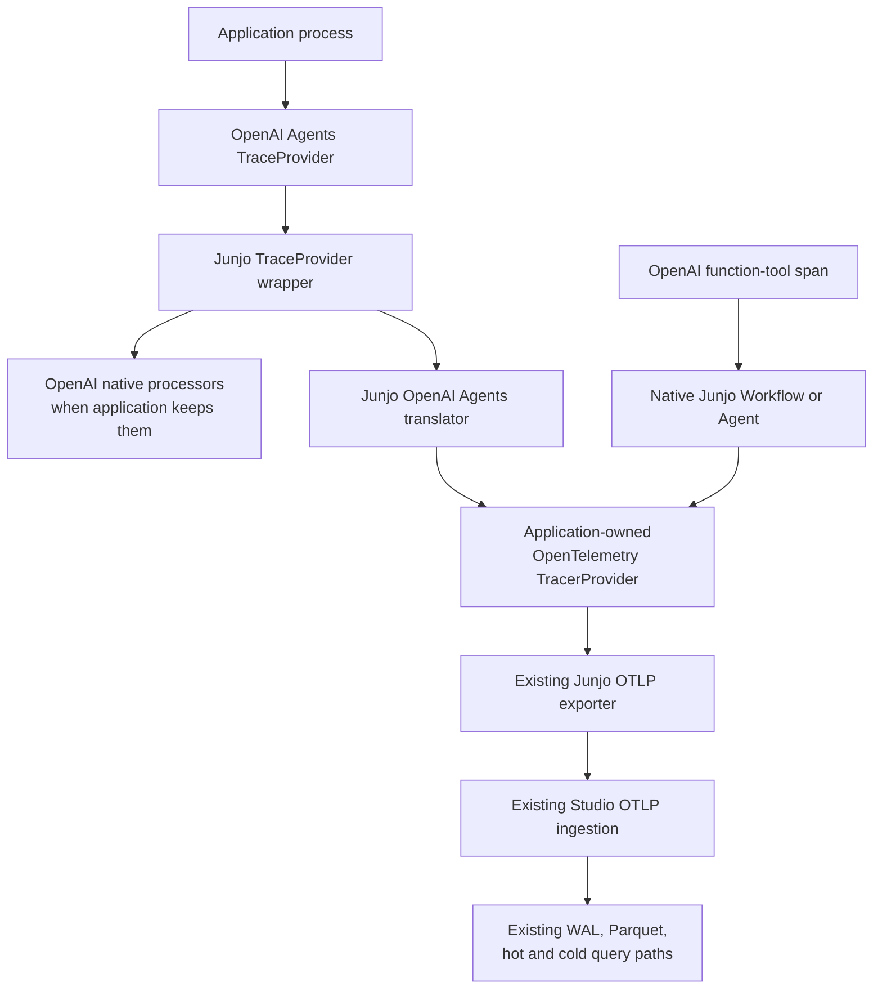

# Junjo First-Party OpenAI Agents Telemetry Bridge Plan

- Status: Implemented and end-to-end validated
- Date: 2026-08-23
- Owners: Junjo platform, Python SDK, telemetry contracts, and Junjo AI Studio
- Scope: Replace the current OpenAI Agents telemetry instrumentation with a
  Junjo-owned bridge over the OpenAI Agents SDK tracing interfaces

## Document purpose and authority

This document is the persistent strategy, implementation plan, and validation
record for complete OpenAI Agents SDK telemetry in Junjo AI Studio.

It extends the broader
[Junjo OpenAI Agents Integration Plan](OPENAI_AGENTS_INTEGRATION_PLAN.md). It
does not replace accepted architectural decisions.
[ADR 0015](docs/adr/0015-optional-agent-framework-integrations.md) owns the
implemented architectural decision; this document owns the coordinated
delivery plan, validation record, and maintenance workflow.

This work is greenfield:

- replace the current implementation directly;
- remove obsolete dependencies, code, tests, configuration, and documentation;
- do not retain deprecated function parameters or compatibility aliases;
- do not support both telemetry implementations;
- do not migrate, reinterpret, or preserve previously stored OpenAI Agents
  spans; and
- local Studio data may be wiped before final end-to-end validation.

The plan is grounded in the OpenAI Agents SDK's first-party tracing boundary.
The SDK creates structured traces for model calls, tool calls, handoffs,
guardrails, and custom activity:

- [OpenAI Agents integrations and observability](https://developers.openai.com/api/docs/guides/agents/integrations-observability#tracing)
- [OpenTelemetry GenAI Agent semantic conventions](https://github.com/open-telemetry/semantic-conventions-genai/blob/main/docs/gen-ai/gen-ai-agent-spans.md)

## Executive decision

Junjo will own the OpenAI Agents-to-OpenTelemetry bridge supplied by
`junjo[openai-agents]`.

The bridge will wrap the active OpenAI Agents `TraceProvider`, delegate normal
OpenAI tracing behavior to the original provider, and create corresponding
OpenTelemetry spans in the application's existing `TracerProvider`. It will
translate every supported OpenAI Agents trace type, preserve the complete
structured source data once on the emitted span, maintain correct active
OpenTelemetry context for nested Junjo execution, and send the resulting
trace through Junjo's existing OTLP exporter.

The implementation will not instrument the OpenAI HTTP client separately for
model operations performed by the Agents SDK. The Agents SDK's own
`ResponseSpanData` and `GenerationSpanData` are the authoritative model-call
source for this integration.

## Goals

1. Capture the complete OpenAI Agents execution hierarchy in Junjo AI Studio.
2. Capture all available inputs, outputs, metadata, usage, errors, and
   framework-specific details by default when the Agents run includes them.
3. Preserve exact parentage between outer OpenAI Agents activity and nested
   native Junjo Workflows, Agents, Nodes, Stores, model operations, and tools.
4. Keep the application in control of its OpenTelemetry provider, exporters,
   OpenAI tracing processors, and shutdown order.
5. Keep external OpenAI Agents spans truthfully distinct from native Junjo
   executable spans.
6. Remove the current incomplete and version-misaligned instrumentation
   dependencies.
7. Make upstream maintenance explicit, testable, and localized.
8. Preserve Junjo's low-resource design by avoiding duplicate spans,
   duplicate content, extra exporter queues, and retained completed-run state.

## Non-goals

This work does not:

- create a generic runtime plugin registry;
- create a universal Agent framework protocol;
- add OpenAI dependencies to base Junjo;
- replace the OpenAI Agents runner, model system, sessions, or handoffs;
- make OpenAI Agents appear as native Junjo Agents;
- add an OpenAI-specific Studio ingestion service;
- copy data from an OpenAI-hosted trace dashboard;
- add direct OpenAI SDK instrumentation outside an Agents run;
- redesign Studio's WAL, Parquet, hot, recent-cold, or cold query paths;
- add metrics ingestion;
- add a new top-level OpenAI Agents page;
- add telemetry payload limits or truncation without a measured failure; or
- preserve the previous implementation or previously stored span shape.

## Product and runtime ownership

### OpenAI Agents SDK owns

- Agent definitions and the runner;
- Agent turns, handoffs, guardrails, tools, and sessions;
- model adapters and model invocation;
- source trace and span objects;
- source trace identifiers and timing;
- the per-run sensitive-data policy; and
- native trace processors and optional hosted trace export.

### Junjo's optional integration owns

- the provider wrapper;
- source Trace and Span wrappers;
- OpenAI Agents source-to-OpenTelemetry mapping;
- complete source-data serialization;
- framework identification attributes;
- active OpenTelemetry context propagation;
- exact external Agent evaluation evidence capture; and
- public integration lifecycle APIs.

### The application owns

- construction and shutdown of the OpenTelemetry `TracerProvider`;
- Junjo OTLP exporter configuration;
- whether OpenAI-native tracing processors remain configured;
- OpenAI per-run sensitive-data settings;
- process startup and shutdown order;
- selection of model providers; and
- construction of OpenAI and Junjo runtime components.

### Junjo AI Studio owns

- authenticated OTLP ingestion;
- storage of the emitted spans and attributes;
- mixed-runtime trace presentation;
- structured presentation of the versioned OpenAI Agents payload;
- native Junjo semantic pages; and
- evaluation history and exact evidence navigation.

## Target architecture



A representative trace is:

```text
OpenAI workflow
└── OpenAI Agent: Coordinator
    ├── OpenAI model response
    ├── OpenAI Tool: research_local_place
    │   └── Junjo Workflow: LocalPlaceWorkflow
    │       ├── Junjo Node: SearchPlacesNode
    │       └── Junjo Node: ComposeResponseNode
    ├── OpenAI Tool: review_response
    │   └── Junjo Agent: ResponseReviewAgent
    └── OpenAI model response
```

The physical parent-child hierarchy is created during execution. The bridge
does not reconstruct it after the fact.

## Optional dependency strategy

The developer experience remains:

```bash
uv add "junjo[openai-agents]"
```

The `openai-agents` optional dependency group will retain the OpenAI Agents
SDK and remove both current OpenTelemetry instrumentor dependencies:

```toml
[project.optional-dependencies]
openai-agents = [
    "openai-agents>=<validated-minimum>",
]
```

Remove:

- `opentelemetry-instrumentation-genai-openai-agents`;
- `opentelemetry-instrumentation-genai-openai`;
- their transitive-only lock entries; and
- every documentation statement and configuration variable owned only by
  those instrumentors.

No alternate extra, second Junjo distribution, or temporary compatibility
group will be added.

## Public lifecycle API

The public entry point remains explicit:

```python
integration = instrument_openai_agents(
    tracer_provider=tracer_provider,
)
```

The returned `OpenAIAgentsIntegration` remains a process-lifetime ownership
handle:

```python
integration.close()
```

The current `disable_openai_trace_export` argument will be deleted. No
deprecated parameter, ignored parameter, or compatibility overload will
remain.

The lifecycle contract is:

1. The application constructs its OpenTelemetry provider and exporters.
2. The application configures its desired OpenAI trace processors.
3. The application calls `instrument_openai_agents()` once during startup.
4. OpenAI and Junjo executions reuse that process-lifetime infrastructure.
5. The application stops creating new Agent runs.
6. The application closes the integration.
7. The application shuts down its OpenTelemetry provider.

The integration never shuts down the application-owned provider or exporter.

Repeated calls for the same active OpenTelemetry provider may share one
registration through reference-counted handles. A different provider cannot
be installed while the integration is active. This remains a simple explicit
process-global constraint because the OpenAI Agents tracing provider is
itself process-global.

## Provider-wrapper design

### `JunjoOpenAIAgentsTraceProvider`

The bridge implements the public OpenAI Agents `TraceProvider` interface and
holds:

- the original OpenAI trace provider;
- the application-owned OpenTelemetry tracer;
- active source-trace mappings;
- active source-span mappings;
- the integration state; and
- synchronization required for installation, closure, and active-map access.

Provider operations behave as follows:

- `register_processor()` delegates to the original provider;
- `set_processors()` delegates to the original provider;
- `get_current_trace()` delegates to the original provider;
- `get_current_span()` delegates to the original provider;
- disabled state and identifier generation delegate;
- `force_flush()` delegates to the original provider;
- `shutdown()` delegates only when OpenAI owns that operation; it never shuts
  down the OpenTelemetry provider;
- `create_trace()` delegates and wraps the returned source Trace; and
- `create_span()` unwraps an explicit wrapped parent, delegates, and wraps the
  returned source Span.

The integration installs the wrapper with the public OpenAI provider setter
and records the original provider. Closing the last integration handle
restores that exact provider.

### Trace wrapper

The Trace wrapper:

- delegates all public Trace properties and serialization;
- starts one OpenTelemetry `invoke_workflow` span when the source trace starts;
- records the source workflow name, group ID, metadata, and source trace ID;
- activates the OpenTelemetry span only when the source Trace is marked
  current;
- leaves it available as the parent of source spans created with an explicit
  Trace parent; and
- ends and removes the mapping when the source Trace finishes.

### Span wrapper

The Span wrapper:

- delegates all public Span properties;
- preserves `set_error()` behavior on the source span;
- chooses its OpenTelemetry parent from the wrapped source parent span or
  wrapped source trace;
- falls back to the ambient OpenTelemetry context for an outer source span;
- creates the small identity and operation attributes at source-span start;
- activates the OpenTelemetry span only when the source Span is marked
  current;
- reads the final source object after the source Span finishes;
- serializes the complete final payload once;
- applies final usage and error attributes;
- ends and detaches the OpenTelemetry span; and
- removes all active-map state.

This preserves nesting for application code executed inside an OpenAI tool.
When that tool invokes a native Junjo Workflow or Agent, Junjo's existing
telemetry sees the active OpenAI tool OpenTelemetry context and becomes its
child naturally.

### Failure isolation

Telemetry translation must not replace the Agent result or exception.

- Source execution errors remain source execution errors.
- The bridge sets OpenTelemetry error status and records available structured
  source error data.
- Serialization failures are contained by the bridge and represented as a
  telemetry translation error on the emitted span.
- The bridge must not swallow cancellation.
- Finalization uses `finally` blocks so active maps and context tokens are not
  retained after failure.

No retry, fallback exporter, or background recovery subsystem is added.

## Native OpenAI trace-export policy

Junjo preserves the original provider and its processors by default. This
allows an application to keep OpenAI-hosted trace export or other processors.

For a Studio-only application, the application explicitly replaces the
OpenAI Agents tracing processors with its chosen empty or non-hosted processor
set before installing Junjo. This is application configuration, not a hidden
Junjo side effect.

The canonical repository example will be Studio-only so it proves Junjo AI
Studio does not depend on another trace backend.

## Telemetry contract

### Truthful identities

OpenAI Agents spans are external framework spans. They never receive native
Junjo executable attributes such as:

```text
junjo.span_type
junjo.executable_runtime_id
junjo.agent.runtime_id
```

Native Junjo descendants continue emitting the current native telemetry
contract unchanged.

### Versioned integration attributes

Every translated OpenAI Agents span receives:

```text
junjo.openai_agents.schema_version = 1
junjo.openai_agents.span.type = <source SpanData type>
junjo.openai_agents.source.trace_id = <source trace id>
junjo.openai_agents.source.span_id = <source span id>
junjo.openai_agents.source.parent_span_id = <source parent id, when present>
junjo.openai_agents.span.data = <one JSON payload>
```

The workflow root receives the corresponding trace data:

```text
junjo.openai_agents.schema_version = 1
junjo.openai_agents.trace.id = <source trace id>
junjo.openai_agents.trace.data = <one JSON payload>
```

The integration schema version is independent of the native Junjo telemetry
contract version. The external spans must not claim to implement the native
Junjo executable contract.

### Shared contract ownership

Because the Python SDK emits these attributes and Studio consumes them, add a
small language-independent integration contract under
`contracts/telemetry/integrations/openai_agents/v1/`.

The contract owns:

- common attribute names;
- source type discriminator;
- trace payload envelope;
- span payload envelope;
- error representation;
- a representative mixed-trace fixture; and
- valid and invalid examples.

The schema validates Junjo's envelope and discriminators. It does not attempt
to duplicate every upstream Response or tool-result schema. Source-specific
payload data remains an open structured object so complete upstream data can
be retained.

### Standard OpenTelemetry projection

The bridge duplicates only small fields needed for open semantic
interoperability, presentation, filtering, and sampling decisions.

| Source boundary | Standard projection |
| --- | --- |
| Source Trace | `gen_ai.operation.name=invoke_workflow`, `gen_ai.workflow.name` |
| `AgentSpanData` | `gen_ai.operation.name=invoke_agent`, `gen_ai.agent.name` |
| `FunctionSpanData` | `gen_ai.operation.name=execute_tool`, `gen_ai.tool.name` |
| `GenerationSpanData` | model operation, request model, response model, and token usage when available |
| `ResponseSpanData` | `chat` model operation, response model, and token usage when available; the source discriminator remains `response` |
| Source error | OpenTelemetry error status, `error.type` when truthfully available, and complete structured error data in the source payload |

Handoff, guardrail, task, turn, MCP, custom, speech, and transcription spans
retain readable names and the integration type discriminator. They receive a
`gen_ai.operation.name` only when an established semantic operation actually
fits. The bridge does not mislabel framework activity to make the UI prettier.

The framework marker identifies the OpenAI Agents SDK. The bridge does not set
`gen_ai.provider.name=openai` on every span because the Agents SDK can execute
models from other providers.

## Complete data capture

### Capture policy

The bridge captures every field made available by the OpenAI Agents source
Trace and Span objects. It does not add a second Junjo-specific privacy switch.

OpenAI Agents `RunConfig.trace_include_sensitive_data` remains the source
policy. When the source includes full data, Junjo records it. When the
application disables source sensitive-data capture, Junjo records the
redacted or absent source fields without attempting to recover them from the
HTTP client.

The source tracing API key is explicitly excluded. It is a credential, not
execution evidence. The payload may record that a dedicated tracing credential
was configured, but it never records the credential value.

### Known source mappings

The first implementation explicitly maps every concrete source type currently
provided by the supported OpenAI Agents version.

#### Trace

Capture:

- trace ID;
- name;
- group ID;
- metadata;
- start and end timing; and
- tracing state relevant to the public source object.

#### Agent

Capture:

- name;
- handoffs;
- tools;
- output type; and
- metadata, including fields omitted by the source object's basic `export()`
  output.

#### Function tool

Capture:

- tool name;
- input;
- output;
- MCP data; and
- source error information.

#### Generation

Capture:

- complete input sequence;
- complete output sequence;
- model;
- model configuration;
- usage; and
- source error information.

#### Response

Capture:

- original input;
- the complete public Response object through its JSON-mode model dump;
- response ID;
- model;
- output items;
- usage;
- response metadata made available by the public model; and
- source error information.

The basic source `export()` output is not sufficient for this type and is not
treated as the complete representation.

#### Handoff and guardrail

Capture:

- originating Agent;
- destination Agent;
- guardrail name;
- triggered state; and
- source error information.

#### Task and turn

Capture:

- task name;
- turn number;
- Agent name;
- usage; and
- metadata.

#### MCP and custom

Capture:

- MCP server identity;
- returned tool names;
- custom name;
- arbitrary custom structured data; and
- source error information.

#### Speech and transcription

Capture all source-provided input, output, format, model, configuration,
timing, and error data. No automatic audio stripping or truncation is added.

### Serialization

The serializer supports:

- JSON scalars;
- mappings and sequences;
- Pydantic models through JSON-mode model dumps;
- dataclasses;
- enums;
- bytes through an explicit JSON-safe representation; and
- otherwise non-serializable application objects through a final string
  representation rather than failing the Agent run.

Serialization occurs once at source-span completion and only for recording
OpenTelemetry spans. Large content is not copied into both standard attributes
and the source payload.

### Unknown future source types

An unknown concrete `SpanData` type still produces a generic span containing:

- its class and source type names;
- its public `export()` output;
- common source IDs and timing;
- error information; and
- the versioned Junjo integration attributes.

No speculative semantic classification is applied. The generic behavior
prevents data loss; repository tests still require maintainers to add an
explicit mapping when the locked dependency introduces a new concrete type.

## Evaluation evidence integration

The current separate OpenTelemetry `_EvidenceObserver` will be deleted.

The provider bridge already owns the exact translated Agent span and its
OpenTelemetry context. When a translated `AgentSpanData` span finishes, it
will consult the existing task-local evaluation capture and record the exact
`OpenTelemetrySpanReference` when the expected Agent name matches.

The evaluation flow becomes:

1. The evaluation runner creates the Attempt and subject role spans.
2. `OpenAIAgentTarget` activates the task-local expected-Agent capture.
3. The OpenAI Runner executes normally.
4. The provider wrapper emits the matching `invoke_agent` span beneath the
   subject role span.
5. The wrapper records the emitted span's service identity, trace ID, and span
   ID in the active capture.
6. The target returns its subject and exact evidence.
7. The runner binds evidence and records the binary evaluation result.

The existing evaluation requirements remain:

- exactly one expected Agent evidence span;
- no nearby-span fallback;
- no fabricated evidence;
- no numeric score;
- task-local separation for concurrent Attempts; and
- native Junjo targets continue binding semantic execution evidence.

Removing the observer also removes one permanent `SpanProcessor` registration
and one scan of every completed OpenTelemetry span.

## Junjo AI Studio treatment

### Ingestion and persistence

No ingestion or persistence architecture change is required. Studio already
stores arbitrary OTLP span names, trace IDs, span IDs, parent IDs, attributes,
events, status, and resource data.

Do not add:

- an OpenAI-specific endpoint;
- an integration-specific database table;
- new indexed columns for every source field;
- a second telemetry store;
- a second query engine; or
- a migration for old OpenAI Agents spans.

### Recognition

Studio recognizes translated spans through:

```text
junjo.openai_agents.schema_version = 1
```

It must not infer the framework solely from `invoke_agent` or `execute_tool`,
because those standard operations can come from other Agent frameworks.

### Trace presentation

The ordinary trace tree remains the authoritative mixed-runtime view.

Studio will:

- show the OpenAI mark on translated OpenAI Agent and tool spans;
- retain the Agent, Tool, and Workflow chips;
- use standard attributes for concise names;
- show model operations as model calls;
- show handoff, guardrail, turn, task, MCP, speech, transcription, and custom
  spans with truthful readable labels;
- render the integration payload as structured details;
- retain a raw JSON view of the complete payload; and
- continue deep-linking native Junjo descendants into their native semantic
  pages.

Studio will not:

- insert external Agents into the native Junjo Agent list;
- invent Junjo executable identity;
- create an evaluation-only trace viewer; or
- add a separate OpenAI Agents navigation section.

### Frontend contract handling

The frontend will add one versioned, safe parser for the integration envelope.
Known payload types receive structured sections; unknown types render the
common fields and raw payload.

The presentation helper, icon helper, schema, and tests must all use the same
integration marker. Generic standard GenAI spans from other frameworks retain
generic GenAI presentation.

## Canonical example changes

The existing `base_openai_agents` example remains the canonical learning and
end-to-end fixture.

Update it to:

- use only `openai-agents` from the optional integration dependency group;
- configure the application-owned OpenTelemetry provider as it does today;
- install the Junjo provider bridge once for process lifetime;
- configure Studio-only OpenAI tracing explicitly in application bootstrap;
- remove instrumentor-specific environment variables;
- run the outer coordinator Agent;
- call a native Junjo Workflow tool;
- call a native Junjo Agent tool;
- exercise subagent or handoff behavior;
- exercise model, tool, guardrail, task, and turn telemetry;
- expose direct native and outer Agent evaluation targets; and
- run repeatedly in one Python process.

The deterministic model remains the required CI path. An optional live model
path remains useful for human validation but is not the only evidence that
the integration works.

## Low-resource behavior

### Cost model

The bridge adds only in-process work:

- one wrapper object for each active source Trace or Span;
- one OpenTelemetry span for each source Trace or Span;
- one final structured serialization for each recording span; and
- active source-to-OpenTelemetry identity mappings.

It does not add:

- synchronous Studio calls;
- control-plane authentication lookups;
- another OpenTelemetry provider;
- another Junjo exporter queue;
- HTTP-client interception;
- completed-span history in application memory; or
- duplicate model spans.

Active mappings are removed as their source object finishes. Memory use is
therefore proportional to concurrently active source spans, not the number of
completed runs.

### Efficiency rules

- Do not serialize the full payload for a non-recording span.
- Serialize the complete payload once.
- Duplicate only small standard fields.
- Do not duplicate complete messages or Response objects across several span
  attributes.
- Do not create a bridge-owned background worker or queue.
- Reuse the application's existing batch exporter.
- Do not add arbitrary telemetry limits before a repeatable failure proves
  they are necessary.

### Required measurements

Record the new deterministic baseline before release:

- source spans and exported OpenTelemetry spans per run;
- serialized OTLP bytes per run;
- bridge CPU and wall-time overhead versus tracing disabled;
- peak process memory;
- retained allocations after repeated runs;
- sequential run throughput;
- concurrent run throughput and trace separation;
- exporter force-flush and shutdown behavior;
- Studio trace availability latency; and
- existing hot and cold trace-query behavior.

The measurement exists to detect duplication, retained state, unexpectedly
large serialization, or broken batching. It does not introduce a performance
architecture before evidence requires one.

### Implementation validation record

The first-party bridge was validated on 2026-08-23 against the locked
`openai-agents==0.22.0` dependency. Its coverage sentinel enumerated all 13
concrete upstream `SpanData` types:

```text
Agent, Custom, Function, Generation, Guardrail, Handoff, MCPListTools,
Response, SpeechGroup, Speech, Task, Transcription, Turn
```

The deterministic measurement used the canonical `base_openai_agents`
application, an in-memory OpenTelemetry exporter, five warm-up runs, and 50
measured runs in a fresh process for each mode. The baseline retained the
example's four native Junjo spans while disabling the OpenAI bridge. These
numbers are regression evidence for this fixture, not capacity claims or
product limits.

| Sequential measurement | Native baseline | First-party bridge | Difference |
| --- | ---: | ---: | ---: |
| Spans per run | 4 | 23 | +19 translated source spans |
| OTLP protobuf bytes per run | 10,382 | 36,574 | +26,192 bytes |
| Median wall time per run | 47.63 ms | 50.84 ms | +3.21 ms |
| 95th-percentile wall time per run | 50.35 ms | 54.14 ms | +3.79 ms |
| CPU time per run | 10.25 ms | 10.85 ms | +0.60 ms |
| Sequential throughput from median time | 20.99 runs/s | 19.67 runs/s | -1.32 runs/s |
| Peak process resident memory on macOS | 138,379,264 bytes | 138,067,968 bytes | No bridge increase observed |
| Peak traced Python allocations | 700,922 bytes | 858,452 bytes | +157,530 bytes |
| Retained traced Python allocations after 50 runs and collection | 110,620 bytes | 176,902 bytes | +66,282 bytes |

A separate concurrent run executed five batches of ten runs in one process:

- 50 source trace IDs and 50 OpenTelemetry trace IDs remained distinct;
- every run produced 23 spans;
- the mean serialized payload was 36,232.6 bytes per run;
- median time for ten concurrent deterministic runs was 104.00 ms; and
- observed throughput was 94.70 deterministic runs per second.

The process-global integration was also exercised through repeated and
concurrent lifecycle tests, clean force-flush, clean integration closure, and
provider shutdown. No completed-span history is owned by the bridge; the
reported retained-allocation difference is the steady process state observed
after the repeated-run sample, not growth per completed run. Process-resident
memory stayed within normal fresh-process measurement noise and was not higher
with the bridge enabled.

The local Compose E2E emitted one canonical trace with 23 spans, including 19
translated OpenAI spans and the four native Junjo spans. It included source
types `agent`, `function`, `generation`, `guardrail`, `task`, and `turn`, plus
the `chat`, `execute_tool`, `invoke_agent`, and `invoke_workflow` semantic
operations. Every deterministic model and tool payload contained its input
and output. The native Junjo Workflow and Agent were direct children of their
corresponding OpenAI tool spans. The trace was visible through Studio's normal
authenticated query path on the first query after clean application shutdown;
that query completed in 51.30 ms.

Chrome inspection of the same trace proved the ordinary Studio trace tree,
OpenAI Agent and Tool presentation, native Workflow Explorer link, structured
source details, full model input/configuration/output/usage, raw payload, and
source identifiers. Existing Studio ingestion integration tests cover the
unchanged WAL, Parquet, hot, recent-cold, and cold query paths; this plugin did
not add or alter an ingestion or persistence path.

The final evaluation E2E installed the built wheel and optional extra into a
clean standalone application repository, created and locked dataset
`OxwH2MvuRVURgAiiYDSXNH`, and completed run
`zr08vSIvcJ1zN9Zf6GaABn`. Its external OpenAI Agent, native Junjo Workflow,
and native Junjo Agent cases all passed. The external Attempt bound exact span
`c307c6b446018097` in trace `dbd2f631e23cfce791e3f98597b52334`; the stored
span is the translated `invoke_agent Local place coordinator` span. Chrome
opened that exact evidence link and showed the evaluation wrapper, complete
mixed runtime tree, native Workflow Explorer link, source Agent details, and
raw versioned payload.

## Source-code organization

Keep responsibilities explicit under
`sdks/python/src/junjo/plugins/openai_agents/`:

```text
__init__.py
_instrumentation.py   # public lifecycle, installation, shared ownership
_trace_provider.py    # provider, Trace, and Span wrappers
_span_mapping.py      # known source mappings and JSON-safe serialization
_evidence.py          # task-local exact external-Agent evidence capture
_tools.py             # existing Workflow and Agent tool adapters
evaluation.py         # existing external Agent evaluation target
```

This is enough separation for the distinct responsibilities. Do not add a
generic adapter framework, registry, dispatcher hierarchy, or plugin base
class.

The complete public surface remains small:

```python
from junjo.plugins.openai_agents import (
    OpenAIAgentsIntegration,
    agent_as_tool,
    instrument_openai_agents,
    workflow_as_tool,
)
```

Evaluation-specific APIs remain in
`junjo.plugins.openai_agents.evaluation`.

## Implementation plan

### Phase 0: Revise the architectural decision

Work:

- amend ADR 0015 before runtime code changes;
- replace the third-party-instrumentor decision with the first-party provider
  bridge;
- record complete source capture and truthful external identity;
- record application ownership of native OpenAI trace processors;
- record that direct client instrumentation is outside this plugin; and
- mark the old implementation as directly replaceable under greenfield rules.

Definition of done:

- ADR 0015 and this plan agree;
- no accepted ADR requires the old packages; and
- the new contract boundaries are explicit before implementation.

### Phase 1: Prove provider wrapping and parentage

Work:

- build the provider, Trace, and Span wrappers against an in-memory
  OpenTelemetry exporter;
- delegate the complete public provider and object interfaces;
- prove ambient OpenTelemetry parenting;
- prove explicit source parent handling;
- prove current-context activation and restoration;
- prove nested Junjo Workflow and Agent parentage;
- prove repeated runs in one process; and
- prove concurrent Agent runs remain separate.

Definition of done:

- one connected mixed trace has exact parentage;
- no source execution semantics change;
- the original OpenAI provider is restored on close;
- no run-scoped state remains after completion; and
- no third-party OpenTelemetry instrumentor is involved in the proof.

### Phase 2: Define the integration telemetry contract

Work:

- add the version-one shared integration schema;
- lock common attribute names;
- add valid and invalid envelope fixtures;
- add one canonical mixed trace fixture;
- implement standard Agent, Workflow, Tool, model, usage, and error
  projections; and
- verify external spans never receive native Junjo executable identity.

Definition of done:

- SDK fixtures validate against the shared contract;
- Studio can parse the same fixture;
- native telemetry remains byte-deterministic and unchanged; and
- the integration contract does not duplicate upstream Response schemas.

### Phase 3: Implement complete source capture

Work:

- implement explicit mappings for every known concrete source type;
- capture complete Response objects rather than the minimal source export;
- capture metadata omitted by minimal source exports;
- implement JSON-safe serialization;
- implement the unknown-type generic path;
- set final usage and error information at span completion;
- serialize only recording spans; and
- add the concrete-source-type coverage sentinel.

Definition of done:

- every known type produces a truthful span and complete payload;
- unknown types cannot disappear silently;
- content follows the source per-run sensitive-data policy;
- serialization errors cannot break Agent execution; and
- fixtures show no duplicated large content.

### Phase 4: Replace the current SDK implementation

Work:

- replace `_instrumentation.py` with the new lifecycle owner;
- add `_trace_provider.py` and `_span_mapping.py`;
- add `_evidence.py` as the internal task-local evidence boundary;
- delete `_EvidenceObserver` and its provider registration;
- integrate evidence capture into translated Agent completion;
- delete `disable_openai_trace_export`;
- remove both instrumentor dependencies;
- regenerate the SDK and example locks;
- delete obsolete tests and replace them with bridge tests;
- update public docstrings and exports; and
- keep `_tools.py` and target behavior unchanged except where telemetry
  evidence ownership moves.

Definition of done:

- `uv add "junjo[openai-agents]"` supplies the complete integration;
- base Junjo imports no OpenAI dependency;
- the old packages are absent from project and example locks;
- the old observer and old public parameter do not exist; and
- direct native and external evaluations still bind exact evidence.

### Phase 5: Update the canonical example

Work:

- replace the example telemetry bootstrap;
- configure its OpenAI processor policy explicitly;
- expand its deterministic run to cover the important hierarchy;
- exercise more than one run per process;
- update its tests, README, and `.env.example`;
- remove instrumentor-specific configuration; and
- retain the optional live path.

Definition of done:

- the deterministic example needs no OpenAI credential;
- the real OpenAI Agents runner is exercised;
- the OpenAI coordinator calls both Junjo tool types;
- complete mixed telemetry reaches an in-memory exporter and local Studio;
- outer and native evaluation targets pass; and
- clean shutdown works.

### Phase 6: Update Studio presentation

Work:

- recognize the versioned integration marker;
- make OpenAI icon classification marker-aware;
- retain standard chips and names;
- add structured payload presentation for known types;
- add raw payload presentation for every type;
- test unknown-type rendering;
- test deep links and selected-span URL state; and
- validate native Junjo links from the mixed trace.

Definition of done:

- Agent and tool spans have the intended OpenAI presentation;
- other frameworks do not receive the OpenAI mark merely because they use
  standard operations;
- all captured data is inspectable;
- unknown types remain usable; and
- no new Studio page or query architecture was needed.

### Phase 7: Full validation and measurement

Work:

- run every SDK quality gate;
- run contract generation and validation;
- run every Studio quality gate;
- build the Python wheel and validate it in a clean environment;
- run the deterministic example against a fresh Studio instance;
- create and execute the example evaluation dataset;
- inspect all exact evidence links in Chrome;
- record low-resource measurements;
- assemble and build public documentation; and
- review the complete change for dead old implementation code and stale
  documentation.

Definition of done:

- the built wheel, not the source checkout, passes the consumer flow;
- one fresh Studio instance contains only the new span shape;
- every known source type has validated coverage;
- mixed traces and evaluation evidence work end to end;
- performance has no unexplained regression or duplication; and
- all documentation owners agree.

## Validation matrix

### SDK lifecycle and interface tests

- base install excludes OpenAI dependencies;
- optional install imports successfully;
- provider installation and restoration;
- repeated same-provider handles;
- different-provider rejection while active;
- complete provider delegation;
- complete Trace delegation;
- complete Span delegation;
- context activation and restoration;
- explicit parent Trace and Span handling;
- source disabled/no-op tracing;
- sampled and unsampled OpenTelemetry spans;
- error and cancellation finalization;
- repeated process-local runs; and
- concurrent task isolation.

### Source mapping tests

- Trace;
- Agent;
- Function;
- Generation;
- Response;
- Handoff;
- Guardrail;
- Task;
- Turn;
- MCP list-tools;
- Custom;
- Speech group;
- Speech;
- Transcription;
- unknown source type;
- metadata omitted by minimal source exports;
- complete Response model dumping;
- JSON-safe arbitrary tool output;
- redacted source data; and
- source error data.

### Composition tests

- outer Agent only;
- parent Agent and subagent;
- handoff;
- guardrail;
- function tool;
- nested native Junjo Workflow;
- nested native Junjo Agent;
- native Node and Store descendants;
- direct Junjo evaluation target;
- outer OpenAI Agent evaluation target; and
- simultaneous evaluation Attempts.

### Studio tests

- integration schema parsing;
- icon classification by marker and operation;
- Agent, Tool, Workflow, and model labels;
- every known structured detail view;
- raw payload fallback;
- unknown source-type fallback;
- mixed trace tree ordering and parentage;
- external span evidence navigation;
- native semantic deep links; and
- absence from native Junjo Agent queries.

### Repository validation

Run at minimum:

- SDK Ruff;
- SDK pytest;
- SDK ty;
- Griffe public-surface validation;
- Python package build and Twine validation;
- clean-wheel example tests;
- shared telemetry contract generation and validation;
- `apps/studio/run-all-tests.sh`;
- frontend lint, tests, and production build;
- fresh Studio Compose and Docker validation;
- deterministic Studio-connected example and evaluation E2E;
- documentation assembly and parity validation;
- website build; and
- repository link and invariant validation.

## Ongoing maintenance

### Single mapping owner

`_span_mapping.py` is the only implementation owner for conversion from
OpenAI Agents source types into Junjo's integration payload and standard
OpenTelemetry projection. Do not duplicate conversion logic in the example,
evaluation target, Studio backend, or frontend.

Studio interprets the versioned emitted contract; it does not import Python
runtime types.

### Dependency-change workflow

When intentionally changing the locked OpenAI Agents dependency:

1. Enumerate concrete `SpanData` subclasses.
2. Compare them with the explicit supported set.
3. Review public TraceProvider, Trace, and Span interface changes.
4. Regenerate source payload fixtures.
5. Update mappings for current source fields and types.
6. Run the deterministic mixed-runtime and evaluation E2E.
7. Compare span count, payload size, memory, and throughput measurements.
8. Update public coverage documentation.

If the current source removes or changes a type, update Junjo directly to the
new current shape. Do not retain branches for previously supported source
types unless a current supported version still emits them.

### Coverage sentinel

A unit test dynamically enumerates every concrete `SpanData` subclass in the
locked dependency and compares it to Junjo's explicit mapping set.

The test failure must name the unreviewed source type and direct the maintainer
to:

- add or deliberately classify the mapping;
- add a source payload fixture;
- add Studio presentation coverage; and
- rerun the mixed-runtime E2E.

The runtime generic path remains so application telemetry is not silently
dropped. The CI sentinel ensures generic behavior does not become an excuse
to leave new current types unreviewed.

### Contract versioning

Additive source span types and additional payload properties remain compatible
within integration schema version 1.

Increment the integration schema only when Junjo changes:

- the meaning of an existing attribute;
- the envelope structure;
- the source identifier representation;
- the error representation; or
- the standard semantic meaning assigned to an existing source type.

Because the project is greenfield, a future schema replacement may delete the
old parser, fixtures, and rendering path together. No stored-data migration is
required.

### Documentation ownership

- ADR 0015 owns the architectural decision and consequences.
- This root plan owns delivery phases, validation, and maintenance workflow.
- Code and tests own exact mappings and behavior.
- Public SDK docs own consumer setup and privacy choices.
- Public docstrings own signatures.
- The example README owns the shortest runnable learning path.
- The packaged skill owns coding-agent workflow and links to public owners.
- Skills must not duplicate source-type mappings or internal implementation.

### Release evidence

Every release that changes this integration must include evidence of:

- the locked OpenAI Agents version;
- the complete known source-type set;
- the deterministic mixed trace;
- exact outer Agent evaluation evidence;
- repeated and concurrent run behavior;
- clean process shutdown;
- clean-wheel installation; and
- the measured telemetry baseline.

## Risks and contained responses

### Process-global OpenAI provider

Risk: incorrect installation or restoration can disrupt the application.

Response: one explicit process-lifetime installation, one stored original
provider, reference-counted same-provider handles, and lifecycle tests. No
per-run installation is allowed.

### Broken OpenTelemetry parentage

Risk: nested Junjo spans could become siblings of their OpenAI tool span.

Response: wrap Trace and Span start/finish rather than passively observing
completion, mirror current-context behavior, and validate the exact hierarchy
with in-memory and Studio-connected tests.

### Incomplete source capture

Risk: minimal source `export()` methods omit important fields.

Response: explicit typed mappings read the complete public source objects,
especially Response, Agent metadata, Task metadata, and Turn metadata.

### Duplicate spans

Risk: model calls could be represented once by Agents tracing and again by an
HTTP-client instrumentor.

Response: remove direct OpenAI client instrumentation from this plugin and use
the Agents source spans as the single model-operation owner.

### Sensitive or large data

Risk: complete trace data may contain private content and large media.

Response: respect the application's OpenAI per-run sensitive-data decision,
store content once, retain self-hosted Studio controls, measure real payloads,
and add no silent truncation.

### Source tracing changes

Risk: the OpenAI Agents SDK can add types or fields.

Response: one localized mapping module, a generic runtime representation, a
concrete-type CI sentinel, fixtures, and an intentional dependency-change
workflow.

### Telemetry translation failure

Risk: an unusual application value cannot be serialized.

Response: JSON-safe recursive serialization with a final string
representation, telemetry error annotation, guaranteed cleanup, and no change
to the Agent result.

### Over-generalization

Risk: one integration grows into a speculative plugin framework.

Response: keep the implementation in `junjo.plugins.openai_agents`, implement
only the current public source interfaces, and add no generic registry or
framework-neutral adapter hierarchy.

## Completion criteria

The plan is complete only when:

- `uv add "junjo[openai-agents]"` installs the first-party bridge;
- base Junjo has no OpenAI dependency or import side effect;
- both current third-party instrumentor dependencies are gone;
- the old runtime implementation and parameter are deleted;
- the OpenAI provider wrapper is explicit and reversible;
- every current source Trace and Span type is represented;
- complete available source data is visible in Studio;
- full Response objects and original model inputs are captured when the source
  run includes them;
- OpenAI and native Junjo spans form one correct physical trace;
- external spans never receive native Junjo executable identity;
- exact outer Agent evaluation evidence is bound without a separate observer;
- Studio recognizes the integration through its versioned marker;
- OpenAI icons are not assigned to unrelated standard GenAI spans;
- the deterministic example proves the complete flow without an OpenAI key;
- repeated and concurrent runs retain no completed-run state;
- low-resource measurements show no unexplained duplication or retention;
- all SDK, contract, Studio, example, package, and documentation gates pass;
  and
- a fresh local Studio instance passes the complete trace and evaluation E2E.
