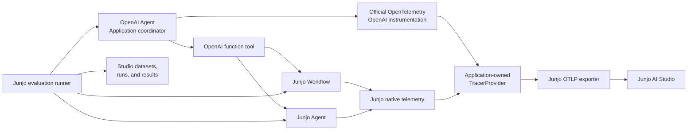

# Junjo OpenAI Agents Integration Plan

- Status: Implemented and E2E validated
- Date: 2026-08-17
- Owners: Junjo platform, Python SDK, and Junjo AI Studio
- Scope: Optional OpenAI Agents SDK integration, mixed-runtime telemetry,
  evaluation support, canonical example, validation, and documentation

## Document purpose and authority

This document is the persistent cross-platform strategy and implementation
plan for making Junjo an additive, batteries-included layer inside
applications that use the OpenAI Agents SDK.

It records the complete intended direction, component boundaries, delivery
order, validation requirements, and documentation work. It does not replace
accepted architectural decision records. Before implementation changes an
accepted contract, the owning ADR must be created or amended and accepted.
Once accepted, ADRs own the decisions and this document remains the delivery
plan that connects those decisions across the repository.

Current related decisions:

- [ADR 0005: Agent and Workflow composition](docs/adr/0005-agent-workflow-composition.md)
- [ADR 0006: Agent telemetry contract](docs/adr/0006-agent-telemetry-contract.md)
- [ADR 0007: Execution correlation and Studio resolution](docs/adr/0007-execution-correlation-and-studio-resolution.md)
- [ADR 0012: Studio trace-only telemetry integration](docs/adr/0012-studio-trace-only-telemetry-integration.md)
- [ADR 0013: Application-executed Studio evaluations](docs/adr/0013-application-executed-studio-evaluations.md)
- [ADR 0014: Evaluation telemetry context](docs/adr/0014-evaluation-telemetry-context.md)
- [ADR 0015: Optional Agent framework integrations](docs/adr/0015-optional-agent-framework-integrations.md)
- [Studio ADR 010: Evaluation control persistence and API](apps/studio/docs/adr/010-evaluation-control-persistence-and-api.md)

## Executive summary

OpenAI Agents remains the application's outer agent runtime. Junjo becomes an
optional execution, telemetry, and evaluation layer inside that application.

A developer installs the integration with:

```bash
uv add "junjo[openai-agents]"
```

The integration provides four related capabilities:

1. An OpenAI Agent can invoke a Junjo Workflow as a function tool.
2. An OpenAI Agent can invoke a Junjo Agent as a function tool.
3. OpenAI and Junjo execution telemetry share one application-owned
   OpenTelemetry trace and are exported to Junjo AI Studio.
4. Junjo's dataset and evaluation system can evaluate both the nested native
   Junjo targets and the outer OpenAI Agent target, then bind every result to
   exact telemetry evidence.

Junjo does not replace the OpenAI Agents SDK runner, model layer, sessions,
handoffs, or agent loop. OpenAI Agents does not replace Junjo's opinionated
Node, Workflow, Agent, state, concurrency, observability, or evaluation
mechanics.

The resulting system lets a coding harness work directly in the application
repository, change application code and prompts, run representative datasets,
and use Junjo AI Studio as the self-hostable record of measurements and trace
evidence for iterative improvement.

## Product positioning

### OpenAI Agents SDK owns

- its Agent definitions and runner;
- its orchestration loop and handoffs;
- its sessions and application context;
- its model adapters and model calls;
- its tools, guardrails, and approvals; and
- its native tracing callbacks and optional OpenAI-hosted trace export.

### Junjo owns

- Junjo Nodes, Workflows, Agents, Subflows, and `RunConcurrent` execution;
- explicit application state and Store transitions;
- deterministic orchestration and concurrency semantics;
- Junjo-native execution identity and telemetry;
- the Studio OTLP destination;
- evaluation datasets, cases, runs, attempts, evaluators, and evidence;
- the SDK evaluation harness and Studio client; and
- coding-agent guidance for constructing and running evaluation loops in the
  application repository.

### The application owns

- the application process and dependency lifecycle;
- construction and shutdown of its OpenTelemetry `TracerProvider`;
- selection of LLM vendors and models;
- composition between OpenAI Agents and Junjo components;
- mapping application dependencies into tools and targets;
- input and output projections; and
- privacy choices for prompt, response, tool argument, and result capture.

### Junjo AI Studio owns

- ingestion and storage of the resulting OpenTelemetry spans;
- a cross-framework trace view;
- native semantic views for Junjo Workflows and Agents;
- Studio-controlled datasets and evaluation runs;
- exact evidence navigation; and
- human and coding-agent query access to telemetry and evaluation history.

## Strategic principles

### Additive, not substitutive

Adding Junjo must not require replacing the application's OpenAI Agent. The
developer adopts Junjo where opinionated stateful Workflows, Agents, telemetry,
or evaluations provide value.

### Explicit application boundaries

Factories, dependency mapping, input validation, output projection, process
lifecycle, and privacy policy remain explicit. The integration must not hide
application ownership behind import side effects or global bootstrapping.

### OpenTelemetry is the integration boundary

Junjo AI Studio receives OpenAI execution through OpenTelemetry. It does not
copy traces from the OpenAI dashboard, depend on the OpenAI trace backend, or
couple Studio ingestion to OpenAI Agents SDK runtime objects.

### Identity remains truthful

OpenAI Agent spans remain OpenTelemetry GenAI spans. They do not receive fake
Junjo executable types, fake Junjo runtime IDs, or `junjo.span_type=agent`.
Native Junjo components retain their existing semantic identity.

### Reversible ownership

Runtime integration must be possible to install and remove without destroying
application-owned providers, exporters, or processors. An integration handle
removes only resources installed by that handle.

### Lean first-party plugin boundary

The first implementation uses a Python optional dependency group and a
namespaced module. It does not create a generic runtime registry or third-party
plugin discovery system before another real integration demonstrates the
required abstraction.

### Evaluation remains application-executed

Datasets and results live in Studio, while the coding agent runs the real
application code in the application repository. There is no hosted prompt
playground, uploaded application bundle, or separate cloud execution runtime.

### Evaluation results remain binary

An evaluated attempt is `passed`, `failed`, or `error`. Evaluators may have
different input and expectation schemas, but this integration does not add a
score field or reinterpret pass/fail as a numeric threshold.

## Target architecture



A representative mixed trace should be:

```text
OpenAI agent run
└── OpenAI Agent: Coordinator
    ├── Model call
    ├── Tool: research_local_place
    │   └── Junjo Workflow: LocalPlaceWorkflow
    │       ├── Junjo Node: SearchPlacesNode
    │       └── Junjo Node: ComposeResponseNode
    ├── Tool: review_response
    │   └── Junjo Agent: ResponseReviewAgent
    └── Model call
```

OpenTelemetry context propagation supplies the parent-child relationships.
The plugin must not reconstruct the tree after execution or copy it from
another telemetry service.

## User stories

### Adopt Junjo without replacing an OpenAI Agent

As an application developer using the OpenAI Agents SDK, I can install
`junjo[openai-agents]` and expose selected Junjo Workflows or Agents as tools
without rewriting my outer Agent or changing my model provider.

### Add opinionated state and concurrency to one part of an application

As an application developer, I can delegate a complex tool operation to a
Junjo Workflow when I need explicit typed state, sequential or concurrent
Nodes, deterministic traversal, and full execution evidence.

### Inspect the complete mixed execution

As a developer, I can open one trace in Junjo AI Studio and see the OpenAI
Agent, its model calls and tools, and the nested Junjo Workflow, Agent, Node,
and Store activity in their real hierarchy.

### Retain native Junjo semantic views

As a developer, I can open a nested Junjo Workflow or Agent in its normal
Studio detail page while retaining a link to the full upstream OpenAI trace.

### Evaluate a nested Junjo component directly

As a coding agent, I can use a Studio dataset to run a Junjo Workflow or Junjo
Agent target directly and bind the result to that native semantic execution.

### Evaluate the complete OpenAI Agent

As a coding agent, I can use a Studio dataset to execute the outer OpenAI
Agent, including its calls into Junjo tools, and bind the binary result to the
exact OpenAI Agent span in the full trace.

### Compare code and prompt revisions

As a coding agent or human developer, I can rerun a locked dataset after a
code or prompt change, compare pass/fail counts and reasons, and inspect the
exact downstream trace differences caused by the change.

### Stay local and self-hosted

As a privacy-sensitive developer, I can disable OpenAI-hosted trace export and
send the OpenTelemetry representation only to my self-hosted Junjo AI Studio.

## 1. Optional plugin packaging

### Distribution model

Add a first-party optional dependency group to
`sdks/python/pyproject.toml`:

```toml
[project.optional-dependencies]
openai-agents = [
    "openai-agents>=<validated-version>",
    "opentelemetry-instrumentation-genai-openai-agents>=1.0b0",
    "opentelemetry-instrumentation-genai-openai>=1.0b0",
]
```

Exact minimum versions must be determined by the implementation's resolved
and tested dependency set. Do not add an upper bound without a demonstrated
incompatibility. The example owns a lockfile so CI validates one concrete
resolution.

### Module boundary

Public integration code belongs under:

```text
sdks/python/src/junjo/plugins/openai_agents/
```

Expected public surface:

```python
from junjo.plugins.openai_agents import (
    OpenAIAgentsIntegration,
    agent_as_tool,
    instrument_openai_agents,
    workflow_as_tool,
)
```

Evaluation-specific symbols belong in a subordinate module:

```python
from junjo.plugins.openai_agents.evaluation import OpenAIAgentTarget
```

The default `junjo` package must not import the optional module. Installing
base Junjo must not install OpenAI Agents or its instrumentation. Importing the
optional module without the extra may raise one direct installation error that
instructs the developer to install `junjo[openai-agents]`; it must not install
packages dynamically or add compatibility fallbacks.

### Why not a separate distribution yet

A separate `junjo-openai-agents` distribution would introduce another
version, release artifact, repository ownership surface, and compatibility
matrix without delivering user value. A first-party extra matches the desired
developer experience and keeps the integration isolated from default runtime
imports.

If future integrations require independent release schedules or third-party
discovery, that is the point to reconsider separate distributions and Python
entry points.

### Explicit non-requirements

The first implementation does not need:

- a plugin registry;
- automatic discovery through entry points;
- dynamic plugin loading or hot replacement;
- a generic framework adapter base class;
- runtime dependency graph management; or
- OpenAI-specific imports in Junjo core modules.

## 2. Runtime instrumentation lifecycle

### Public operation

The plugin provides one explicit process-startup function:

```python
integration = instrument_openai_agents(
    tracer_provider=tracer_provider,
    disable_openai_trace_export=True,
)
```

The returned `OpenAIAgentsIntegration` handle records ownership of only the
processors and instrumentors it installed:

```python
integration.close()
```

The handle may also support the context-manager protocol for tests and short
scripts, but long-running applications should keep it for process lifetime.

### Lifecycle rules

The integration must:

- accept an explicit application-owned `TracerProvider`;
- never replace the global provider;
- never shut down the provider;
- never shut down an application-owned Junjo exporter;
- install each official instrumentor at most once;
- detect already-installed official instrumentation;
- avoid duplicate OpenAI tracing processors and duplicate OpenTelemetry spans;
- preserve processors it does not own;
- remove only processors installed by this integration;
- support repeated application and evaluation runs in one Python process; and
- remain safe when multiple asynchronous Agent runs execute concurrently.

This follows the useful Cordis temporal-composability principle without
bringing a dynamic component substrate into Junjo. Every registration made by
the integration has an explicit inverse, and application-owned infrastructure
remains outside that inverse.

### Existing application configurations

The integration must handle these common starting points:

1. **OpenAI Agents already installed, no OpenTelemetry instrumentation.**
   The helper installs the official instrumentation and uses the supplied
   provider.
2. **Junjo telemetry already configured.** The helper adds only the OpenAI
   instrumentation; both emit into the same provider.
3. **Official OpenAI OpenTelemetry instrumentation already configured.** The
   helper must not instrument a second time. Composition adapters still work,
   and evaluation evidence capture attaches to the supplied provider.
4. **OpenAI native trace export already active.** It remains active unless the
   developer explicitly requests `disable_openai_trace_export=True`.
5. **Studio-only local or private deployment.** The developer disables native
   OpenAI export and sends the OpenTelemetry representation through Junjo's
   OTLP exporter.

Package installation order is irrelevant. Runtime initialization must occur
after the application creates its tracer provider and before its first OpenAI
Agent run.

## 3. Junjo Workflow and Agent tool adapters

### `workflow_as_tool`

`workflow_as_tool` returns an OpenAI Agents SDK function tool that executes a
fresh Junjo Workflow.

It requires:

- a stable OpenAI tool name;
- a concise tool description;
- a Pydantic input model;
- an explicit factory for a fresh Workflow, Store, dependencies, and optional
  correlation;
- an explicit projector from the detached `ExecutionResult` to tool output;
- optional application-owned cleanup; and
- no plugin-owned retry policy.

Illustrative API:

```python
location_tool = workflow_as_tool(
    name="research_local_place",
    description="Research a realistic local place recommendation.",
    input_type=LocalPlaceInput,
    workflow_factory=build_local_place_workflow,
    output_projector=lambda result: result.state.response,
)
```

### `agent_as_tool`

`agent_as_tool` returns an OpenAI function tool that executes a fresh Junjo
Agent invocation.

It requires the same explicit boundary:

- stable name and description;
- typed input;
- explicit Agent and state construction;
- explicit application dependency and history mapping;
- explicit detached result projection; and
- application-owned cleanup where required.

### Execution rules

Both adapters must:

- create a new execution object for each tool call;
- avoid hidden sharing of mutable Stores or Agent state;
- preserve the current OpenTelemetry context;
- propagate cancellation into Junjo execution;
- propagate Junjo failure as a tool failure;
- preserve Junjo's normal failure identity and telemetry;
- avoid hidden retries or recovery behavior;
- avoid serializing calls that are safe to run concurrently; and
- release only resources created for that invocation.

The OpenAI tool call span becomes the natural parent of the native Junjo root
span. No synthetic linking or post-processing is required.

### Reverse composition

A Junjo Node can call the OpenAI Agents SDK's `Runner` as ordinary application
code while preserving OpenTelemetry context. The MVP does not add a generic
`OpenAIAgentNode`. Add one only after repeated application code demonstrates a
stable, reusable input, dependency, output, failure, and cancellation mapping.

## 4. OpenAI and Junjo telemetry

### Native OpenAI tracing is not OTLP by itself

The OpenAI Agents SDK creates its own traces and spans for Agent runs, model
activity, function tools, handoffs, guardrails, and custom activity. Its
default tracing path is not Junjo's OpenTelemetry exporter. Junjo therefore
needs an in-process OpenTelemetry bridge, not a copy operation from an OpenAI
dashboard.

Official OpenAI reference:

- [OpenAI Agents integrations and observability](https://developers.openai.com/api/docs/guides/agents/integrations-observability)

### Use official OpenTelemetry instrumentation

The plugin adopts the official OpenTelemetry packages:

- [OpenTelemetry instrumentation for OpenAI Agents](https://pypi.org/project/opentelemetry-instrumentation-genai-openai-agents/)
- [OpenTelemetry instrumentation for the OpenAI client](https://pypi.org/project/opentelemetry-instrumentation-genai-openai/)
- [OpenTelemetry GenAI Agent semantic conventions](https://github.com/open-telemetry/semantic-conventions-genai/blob/main/docs/gen-ai/gen-ai-agent-spans.md)

The current Agent instrumentor emits standard operations for:

- `invoke_workflow`;
- `invoke_agent`; and
- `execute_tool`.

The companion OpenAI client instrumentor emits underlying model-client spans.
The combined hierarchy is delivered through the same application-owned
provider and Junjo OTLP exporter as native Junjo telemetry.

### Do not write a competing general translator

Junjo should not maintain a full duplicate mapping for OpenAI Agent, tool, and
model operations while an official OpenTelemetry implementation exists. Doing
so would create duplicate spans, competing semantic interpretations, and a
permanent compatibility burden.

### Coverage gaps

The official OpenAI Agents runtime records more native event types than the
current official OpenTelemetry Agent instrumentor emits. The implementation
must maintain a tested coverage matrix for at least:

- runner/workflow boundary;
- Agent invocation;
- function tool invocation;
- model call;
- handoff;
- input and output guardrails;
- task and turn boundaries;
- custom spans;
- speech and transcription, when applicable; and
- error and cancellation state.

The first implementation adopts the official spans and measures the actual
gaps. If a missing operation materially hides application behavior, Junjo may
add one narrow companion processor for unsupported OpenAI trace types.

Such a processor must:

- emit only types the official instrumentor does not emit;
- never duplicate model, Agent, Workflow, or tool operations;
- use standard OpenTelemetry semantics where available;
- use clearly versioned integration-local attributes where no standard exists;
- include direct fixture coverage against the supported OpenAI Agents version;
  and
- be removed or narrowed when official instrumentation adds equivalent
  support.

Non-OpenAI model clients remain outside this plugin's model-provider policy.
Their model-level telemetry should come from the applicable OpenTelemetry
instrumentation for that provider. The OpenAI Agents integration continues to
provide the surrounding Agent and tool topology.

### Content capture and privacy

The standard trace hierarchy can exist without prompt or response content.
The official GenAI instrumentation defaults to not capturing message content.
The canonical local example explicitly enables:

```env
OTEL_INSTRUMENTATION_GENAI_CAPTURE_MESSAGE_CONTENT=SPAN_ONLY
```

This supplies the evidence expected from a local Junjo AI Studio development
environment: prompts, completions, function arguments, and return values are
available on spans where supported.

The plugin must not silently change this process-wide privacy choice. Public
documentation must explain that captured content may include application
secrets, user data, and model inputs or outputs. Production deployments choose
their own setting.

### Native OpenAI trace export

Adding Junjo must not silently disable an existing OpenAI trace destination.
The helper preserves native OpenAI trace export by default and exposes the
official disable choice explicitly.

The canonical self-hosted example uses:

```python
instrument_openai_agents(
    tracer_provider=tracer_provider,
    disable_openai_trace_export=True,
)
```

This proves that Studio does not require an OpenAI trace dashboard. The docs
must also explain that retaining both exporters introduces two delivery queues
and two network destinations.

## 5. Junjo AI Studio treatment

### Ingestion

No ingestion architecture change is planned. Studio already accepts and
retains arbitrary OTLP spans, Resource attributes, span attributes, events,
status, trace IDs, span IDs, and parent IDs.

The integration must not add:

- an OpenAI-specific ingestion endpoint;
- polling or copying from OpenAI;
- an OpenAI-specific WAL format;
- a second telemetry database;
- a separate hot or cold query path;
- evaluation metadata on every descendant span; or
- metrics ingestion as part of this initiative.

The existing segmented WAL, Parquet storage, hot snapshots, recent-cold
bridging, and DataFusion query architecture remain unchanged.

### Truthful recognition

Studio recognizes external Agent telemetry from standard `gen_ai.*`
attributes. It does not transform those spans into native Junjo executables.

Specifically, Studio must not:

- assign `junjo.span_type=agent` to an OpenAI span;
- invent `junjo.executable_runtime_id`;
- list an OpenAI Agent in a native Junjo Agent view whose contract expects
  Junjo state, limits, and operations; or
- treat every standard `invoke_workflow` operation as a native Junjo Workflow.

### Cross-framework trace view

The normal trace view is the authoritative end-to-end mixed-runtime view. It
should present standard GenAI operations with human-readable labels such as:

- OpenAI Agent run;
- OpenAI Agent;
- Tool call;
- Model call;
- Junjo Workflow;
- Junjo Agent; and
- Junjo Node.

The raw standard operation and important attributes remain inspectable.

When an OpenAI tool span contains a native Junjo Workflow or Agent root span,
the UI should provide a normal deep link into that native execution page.
Native Junjo pages should provide a path back to the complete trace so the
developer can inspect upstream Agent decisions and downstream effects.

The first version does not add a new top-level OpenAI Agents page or place
OpenAI Agents into the existing native Agent list.

## 6. Evaluation architecture

### Supported evaluation scopes

The integration supports three useful scopes:

1. A Junjo Workflow invoked directly as the subject.
2. A Junjo Agent invoked directly as the subject.
3. The outer OpenAI Agent, including all nested model and Junjo tool activity,
   invoked as the subject.

Direct native Junjo targets continue using existing target classes and
semantic execution references. The external OpenAI Agent target belongs to the
optional plugin.

### Target kind remains conceptual

An OpenAI Agent target uses `TargetKind.AGENT`. Do not create a vendor-specific
target kind such as `OPENAI_AGENT`.

The target declaration and Studio dataset continue to show the scope as:

```text
Agent → <application-declared target name>
```

The implementation framework is visible in the trace evidence, not encoded as
a different evaluation concept.

### Generalize execution binding into evidence binding

The current Attempt contract binds only a native Junjo semantic execution.
That cannot truthfully represent an external OpenAI Agent. Generalize the
contract into a discriminated evidence reference.

Native reference:

```json
{
  "kind": "junjo_execution",
  "service_namespace": "junjo.examples",
  "service_name": "openai-agents-example",
  "executable_type": "workflow",
  "runtime_id": "..."
}
```

External span reference:

```json
{
  "kind": "otel_span",
  "service_namespace": "junjo.examples",
  "service_name": "openai-agents-example",
  "trace_id": "...",
  "span_id": "..."
}
```

The evaluation Dataset, Run, Case, and Attempt IDs remain the authoritative
evaluation identities. Trace and span IDs are physical evidence pointers only.
Studio must not infer evaluation membership solely from telemetry.

### SDK contract changes

Introduce:

- `ExecutionEvidenceReference` as the discriminated union;
- `SemanticExecutionReference` for native Junjo evidence; and
- `OpenTelemetrySpanReference` for external evidence.

Rename:

- `TargetExecution.execution` to `TargetExecution.evidence`;
- `TargetExecutionError.execution` to `TargetExecutionError.evidence`;
- SDK client `bind_attempt_execution` to `bind_attempt_evidence`; and
- corresponding Studio DTO and route terminology from execution to evidence.

This is a greenfield contract change. Do not retain compatibility aliases,
legacy fields, or duplicate endpoints.

### `OpenAIAgentTarget`

The optional plugin implements an `OpenAIAgentTarget` conforming to the Junjo
evaluation target protocol.

It accepts:

- a stable target key and display name;
- a versioned Pydantic input model;
- an OpenAI Agent factory;
- explicit input projection into the Runner;
- an optional `RunConfig` factory;
- the expected starting Agent name;
- an output projector for the evaluator subject; and
- application-owned resources through the existing evaluation runtime.

It executes under Junjo's existing bounded `junjo.evaluation.subject` role
span and returns:

- the projected `Runner` final output as the evaluator subject;
- an exact `OpenTelemetrySpanReference` for the matching `invoke_agent` span;
  and
- the measured target duration.

If official instrumentation does not emit the exact expected Agent span, the
target fails clearly. It must not fabricate evidence or fall back to a nearby
unrelated span.

### Exact external span capture

The plugin adds a lightweight, non-exporting span observer to the supplied
application tracer provider when external Agent evaluation support is used.

The flow is:

1. The Junjo evaluation runner creates the Attempt orchestration span.
2. The runner creates its bounded subject role span.
3. `OpenAIAgentTarget` activates one target-local capture context.
4. OpenAI `Runner.run()` executes normally.
5. The official OpenTelemetry instrumentation ends the matching
   `invoke_agent` span.
6. The observer records that span's service namespace, service name, trace ID,
   and span ID into the active target capture.
7. The target returns its subject and evidence.
8. The runner binds evidence to the Studio Attempt.
9. The evaluator runs and records a binary result.

The observer must:

- mutate no spans;
- export no spans;
- retain no completed run state after the target returns;
- use task-local context so concurrent evaluations do not cross-bind;
- match the declared Agent operation and name;
- work with instrumentation installed by either Junjo or the application; and
- add only a constant early-return check to non-evaluation span completion.

### Studio API changes

Replace the execution binding endpoint with an evidence binding endpoint:

```text
PUT /api/v1/evaluation/attempts/{attempt_id}/evidence
```

The request contains one `ExecutionEvidenceReference`. The operation remains
idempotent for the same evidence and conflicting for a different reference
after binding.

Update together:

- backend request and response schemas;
- backend service and repository methods;
- SDK Studio DTOs and client methods;
- CLI behavior that consumes Attempt details;
- frontend schemas and API helpers;
- MSW fixtures;
- backend contract tests;
- SDK client tests; and
- frontend navigation tests.

### Studio persistence changes

Reshape the evaluation Attempt table to store one explicit evidence shape:

- `subject_evidence_kind`;
- `subject_service_namespace`;
- `subject_service_name`;
- `subject_executable_type` for native evidence;
- `subject_runtime_id` for native evidence;
- `subject_trace_id` for OTLP evidence;
- `subject_span_id` for OTLP evidence; and
- `evidence_bound_at`.

Use SQLite constraints that require:

- all evidence fields to be null before binding;
- all common and native fields, and no OTLP fields, for
  `junjo_execution` evidence;
- all common and OTLP fields, and no native fields, for `otel_span` evidence;
- bound evidence before a passed or failed result; and
- error Attempts to remain valid with or without evidence, depending on when
  target failure occurred.

Use separate partial unique indexes for native semantic evidence and exact
OTLP span evidence. Do not store the reference as an unvalidated JSON blob.

Because the project is greenfield, delete and regenerate the existing initial
migration through the repository's canonical migration generation workflow
after the data model is final. Do not add a production-data compatibility
migration or hand-edit the database.

### Evidence navigation

For native evidence, Studio opens the normal Junjo Workflow or Agent detail
page through its semantic identity.

For OTLP span evidence, Studio opens the normal full trace page and selects the
exact referenced span. It must not route through a temporary resolver page or
render a separate evaluation-only trace viewer.

The evaluation UI continues to use the label `View spans` for the evidence
action.

## 7. Canonical `base_openai_agents` example

Create a new SDK example:

```text
sdks/python/examples/base_openai_agents/
```

This is separate from AI Chat and from the minimal native Junjo example. It is
both public learning material and the canonical integration E2E fixture.

### Required application shape

The example contains:

- one OpenAI coordinator Agent;
- one Junjo Workflow exposed through `workflow_as_tool`;
- one Junjo Agent exposed through `agent_as_tool`;
- meaningful typed state and input models;
- one application-owned tracer provider;
- the existing Junjo OTLP exporter;
- both official OpenAI OpenTelemetry instrumentors;
- explicit message-content capture for local development;
- explicit Studio-only versus dual trace-export configuration;
- process-lifetime telemetry infrastructure;
- run-scoped application execution resources; and
- clean repeated execution in one Python process.

### Offline and live execution

The example provides two modes:

1. **Offline deterministic mode.** A fake OpenAI Agents model deterministically
   requests both Junjo tools. This is the required CI and E2E path and needs no
   OpenAI credential.
2. **Live mode.** A real OpenAI model exercises ordinary Agent reasoning and
   tool selection. This is an optional human validation path using
   `OPENAI_API_KEY`.

The deterministic mode must not bypass the actual OpenAI Agents runner, tool
dispatch, official tracing processor, Junjo adapters, or Junjo execution
engines. Only model response generation is replaced.

### Evaluation capabilities

The example registers:

- a direct Junjo Workflow target;
- a direct Junjo Agent target;
- the outer OpenAI Agent target;
- one or more simple binary evaluators;
- typed expectation schemas; and
- target and evaluator metadata available through `junjo eval capabilities`,
  `targets list`, and `evaluators list`.

A coding agent can use the existing Studio-controlled loop to create a
dataset, author or generate cases, run the dataset against any registered
scope, and query results and trace evidence.

The repository does not automatically seed an evaluation dataset. Dataset
construction remains an explicit coding-agent or developer operation.

### Example environment file

The example `.env.example` should be grouped and commented by responsibility:

```dotenv
# OpenAI model execution
# OPENAI_API_KEY=sk-...

# Junjo AI Studio application telemetry
# JUNJO_AI_STUDIO_API_KEY=jtel_...
JUNJO_AI_STUDIO_OTLP_ENDPOINT=localhost:26155
JUNJO_AI_STUDIO_OTLP_INSECURE=true

# Junjo AI Studio developer and coding-agent control access
# JUNJO_AI_STUDIO_CLI_TOKEN=jcli_...
JUNJO_AI_STUDIO_BACKEND_BASE_URL=http://localhost:26154

# Local full-evidence OpenTelemetry capture
OTEL_INSTRUMENTATION_GENAI_CAPTURE_MESSAGE_CONTENT=SPAN_ONLY
```

The final names must match the current SDK and Studio configuration contracts.
Do not introduce alternate example-only names. The example does not configure a
Studio frontend URL because neither its application runtime nor its evaluation
harness opens browser routes; Studio evidence paths remain server-owned data.

### Workspace and CI ownership

Add the example as a Python SDK workspace member. Its lockfile and tests belong
to SDK validation. The offline smoke should run in ordinary SDK CI. A separate
Studio-connected E2E test validates the complete exported experience.

## 8. Low-resource behavior

### Expected incremental cost

The integration adds telemetry proportional to actual OpenAI operations:

- one Agent-run or workflow boundary span;
- one span per invoked Agent;
- one span per function tool;
- model-client spans from the relevant model instrumentation;
- optional spans for material unsupported OpenAI trace types; and
- larger span payloads when content capture is enabled.

It does not add:

- an additional Junjo network round-trip on every tool call;
- a synchronous Studio control-plane lookup on application execution;
- a second Studio ingestion service;
- per-span evaluation database writes;
- a new telemetry cache;
- a new Studio in-memory index; or
- another copy of telemetry inside Studio.

OpenTelemetry continues using Junjo's existing batch exporter. Evaluation
control API calls remain outside ordinary application execution.

### Dual exporter impact

When native OpenAI trace export remains active, the process has two telemetry
destinations and therefore two delivery queues and network paths. This is an
explicit developer choice. The local and privacy-oriented example disables
native OpenAI export.

### Measurement plan

Before release, record the observed impact instead of inventing arbitrary
limits:

- span count per deterministic example run;
- serialized OTLP bytes per run with and without message content;
- application peak memory;
- exporter queue and shutdown behavior;
- repeated-run memory retention;
- concurrent-run trace separation;
- Studio ingestion throughput for the fixture;
- trace availability latency; and
- hot and cold trace-query behavior after the imported spans age through the
  existing storage lifecycle.

The objective is to catch duplicate instrumentation, unbounded retained state,
and unexpectedly large content payloads. No new architectural layer should be
introduced unless a repeatable measured problem requires it.

## 9. Documentation ownership and updates

Documentation work is part of each implementation phase, not a cleanup task
after code completion.

### New cross-platform ADR

Create the next numbered ADR for optional external Agent framework
integrations. It owns:

- optional dependency and namespaced module strategy;
- no generic plugin registry in the first version;
- explicit and reversible runtime lifecycle;
- application-owned provider and exporter lifecycle;
- official OpenTelemetry instrumentation as the primary bridge;
- truthful external versus native execution identity;
- framework-specific composition adapters; and
- native versus external Studio presentation boundaries.

### Amend existing cross-platform ADRs

Amend [ADR 0005](docs/adr/0005-agent-workflow-composition.md) to record that
the repeated OpenAI-specific tool shape justifies first-party
`workflow_as_tool` and `agent_as_tool` adapters while preserving explicit
mapping and lifecycle rules.

Amend [ADR 0013](docs/adr/0013-application-executed-studio-evaluations.md) to
define external application-flow targets and the discriminated evidence
reference. Make clear that trace IDs are physical evidence pointers, not
evaluation identity.

Amend [ADR 0014](docs/adr/0014-evaluation-telemetry-context.md) to clarify that
bounded evaluation role spans may parent externally instrumented target spans
and that evaluation attributes remain bounded rather than copied onto every
OpenAI descendant.

Amend [ADR 0012](docs/adr/0012-studio-trace-only-telemetry-integration.md) only
if its accepted scope needs explicit language for first-party external Agent
instrumentation. Do not alter the trace-only Studio decision or add metrics.

### Amend Studio ADR

Amend
[Studio ADR 010](apps/studio/docs/adr/010-evaluation-control-persistence-and-api.md)
to own:

- the evidence reference union;
- the renamed evidence binding endpoint;
- the Attempt persistence constraints;
- native semantic and OTLP span evidence resolution; and
- greenfield migration regeneration.

### Public SDK guide

Add a source-owned public guide under the Python SDK documentation for
"OpenAI Agents integration." It covers:

- installation with `junjo[openai-agents]`;
- application telemetry bootstrap;
- pre-existing instrumentation behavior;
- native OpenAI trace export behavior;
- message-content privacy;
- Workflow and Agent tool adapters;
- direct and outer Agent evaluation targets;
- supported telemetry coverage;
- known limitations; and
- links to the canonical example.

Do not duplicate public function signatures manually. Public docstrings and
the generated API surface own exact signatures.

### Canonical example README

The example README is a short runnable onboarding path:

1. copy `.env.example` to `.env`;
2. start local Studio;
3. run the deterministic example;
4. optionally run the live model example;
5. inspect the full trace and nested Junjo execution;
6. ask a coding agent to create and run a dataset; and
7. inspect evaluation results and exact evidence.

It links to the public guide rather than repeating architecture, every
environment variable, or every evaluation API operation.

### Coding-agent skills

Create a distributable `junjo-openai-agents` skill with concise guidance for
consumer-repository coding agents. It owns:

- when the optional extra is appropriate;
- where telemetry startup belongs;
- how to discover the installed adapter and target APIs;
- the explicit application mapping decisions the coding agent must make;
- how to validate mixed trace evidence; and
- links to public documentation and the canonical example.

Update the existing
[Junjo evaluation skill](sdks/python/skills/junjo-evaluation/SKILL.md) so a
coding agent can discover and use an external Agent target through the same
capability-driven evaluation workflow.

Skills must not duplicate:

- function signatures;
- environment-variable catalogs;
- Studio database schemas;
- backend route implementation details; or
- version-specific instrumentation internals.

Those details remain owned by code, generated API references, configuration
docs, tests, and ADRs.

### Maintainer guidance

Do not add a new root maintainer skill initially. The root and scoped
`AGENTS.md` files already route SDK, Studio, telemetry, frontend, backend, and
contract changes. Add concise links only if implementation proves that coding
agents repeatedly miss the new cross-system owner.

### Changelog and release documentation

The Python SDK changelog must describe:

- the additive optional extra;
- the new plugin imports;
- OpenTelemetry instrumentation requirements;
- privacy behavior; and
- the example and evaluation target.

The Studio changelog must describe the greenfield evaluation evidence contract
and UI navigation changes. Release notes must identify the minimum coordinated
SDK and Studio versions when outer OpenAI Agent evaluation is included.

## 10. Detailed implementation surface

### Python SDK packaging

- `sdks/python/pyproject.toml`
- SDK lockfile
- workspace member configuration
- public surface validation configuration, if required
- SDK changelog

### Python plugin runtime

- `sdks/python/src/junjo/plugins/openai_agents/__init__.py`
- explicit instrumentation lifecycle module
- Workflow tool adapter module
- Agent tool adapter module
- integration-local types and errors
- plugin unit tests

### Python evaluation integration

- plugin-owned `OpenAIAgentTarget`
- target-local span capture
- core evidence reference DTOs
- `TargetExecution` and `TargetExecutionError` rename
- Studio client evidence binding
- CLI serialization and output where affected
- evaluation tests

### Studio backend

- evaluation request and response schemas
- evaluation service and repository
- Attempt persistence model and constraints
- evidence lookup and response projection
- backend endpoint contract tests
- regenerated initial migration

### Studio ingestion and query

- no expected write-path changes
- conformance fixture proving arbitrary standard GenAI spans remain intact
- exact trace/span lookup validation
- verification that external spans are not classified as native Junjo owners

### Studio frontend

- evaluation API schema changes
- native-versus-span evidence navigation
- standard GenAI presentation helpers
- trace tree labels
- full-trace and native-detail cross-links
- MSW fixtures and Vitest coverage
- no new global state unless existing feature state cannot own the behavior

### Example and developer tooling

- `sdks/python/examples/base_openai_agents/`
- deterministic fake model
- optional live model
- CLI capability registration
- environment example
- example tests and smoke command
- Studio-connected E2E orchestration

### Documentation

- new and amended ADRs
- public SDK guide
- generated API surface
- example README
- `junjo-openai-agents` consumer skill
- updated `junjo-evaluation` skill
- changelogs
- assembled public documentation and website validation

## 11. Delivery plan

### Phase 0: Decisions and compatibility proof

Work:

- create and accept the new integration ADR;
- amend ADRs 0005, 0012 if needed, 0013, 0014, and Studio ADR 010;
- lock the proposed public API names and ownership rules;
- resolve and inspect the current OpenAI Agents and OpenTelemetry packages;
- prove one mixed trace using an in-memory exporter;
- prove repeated runs in one process;
- prove existing-instrumentation and fresh-instrumentation startup paths;
- inventory native OpenAI trace types against emitted OpenTelemetry spans; and
- record the first telemetry coverage matrix.

Definition of done:

- every cross-system contract change has an accepted owner;
- official instrumentation produces the required Agent, tool, and model
  hierarchy;
- no duplicate spans occur in either startup path; and
- known coverage gaps are explicit before production implementation.

### Phase 1: Optional SDK plugin and composition

Work:

- add the optional dependency group;
- add the namespaced plugin package;
- implement reversible instrumentation lifecycle;
- implement `workflow_as_tool`;
- implement `agent_as_tool`;
- isolate optional imports from base Junjo;
- add public docstrings and exports;
- test typing, schemas, fresh construction, projection, failure,
  cancellation, cleanup, concurrency, and lifecycle; and
- update SDK public docs and changelog for this slice.

Definition of done:

- `uv add "junjo[openai-agents]"` supplies the complete integration;
- base Junjo remains free of OpenAI dependencies;
- an OpenAI Agent can call both Junjo component types;
- one coherent in-memory trace proves correct parentage; and
- repeated runs do not fail or retain run-scoped resources.

### Phase 2: Canonical example

Work:

- add `base_openai_agents` as a workspace member;
- implement the coordinator, Junjo Workflow, and Junjo Agent;
- add deterministic and live execution modes;
- configure one application-owned telemetry lifecycle;
- add direct Junjo evaluation targets and binary evaluators;
- write the example README and `.env.example`;
- add offline smoke tests; and
- add a local Studio trace validation script or test.

Definition of done:

- CI runs the real OpenAI Agent runner without an OpenAI credential;
- the coordinator invokes both Junjo tools;
- the trace tree contains standard OpenAI and native Junjo spans; and
- a human can run the same flow locally using documented defaults.

### Phase 3: Generic evaluation evidence contract

Work:

- implement the evidence reference union in the SDK;
- rename target execution fields to evidence terminology;
- replace the Studio attempt binding endpoint;
- update SDK, CLI, backend, and frontend contracts together;
- reshape Attempt persistence and constraints;
- regenerate the greenfield initial migration;
- retain native semantic resolution behavior;
- add exact OTLP span evidence lookup; and
- update the owning ADRs and public evaluation documentation.

Definition of done:

- existing Node, Workflow, and Agent evaluations behave identically through
  the new terminology;
- native evidence still opens native execution detail;
- span evidence is representable and queryable; and
- no legacy execution endpoint, alias, or compatibility column remains.

### Phase 4: Outer OpenAI Agent evaluation

Work:

- implement the target-local span observer;
- implement `OpenAIAgentTarget`;
- integrate dataset generation and evaluation execution;
- bind the exact Agent span before evaluator judgment;
- add external target errors and interruption behavior;
- add offline deterministic evaluation cases;
- update the consumer evaluation skill; and
- add complete SDK-to-Studio E2E tests.

Definition of done:

- a coding agent can create a dataset and run it against the outer OpenAI
  Agent;
- each Attempt records pass, fail, or error without a numeric score;
- every completed subject has exact evidence;
- concurrent Attempts cannot cross-bind spans; and
- the same Python process can execute more than one evaluation run.

### Phase 5: Studio mixed-runtime UX

Work:

- add readable standard GenAI labels to the trace tree and details;
- preserve raw standard attributes;
- add trace-to-native Junjo links;
- add native Junjo-to-full-trace links;
- add evaluation span-evidence navigation;
- validate deep links and browser history behavior; and
- test all UX paths with real E2E fixture data.

Definition of done:

- a human can understand which layer is the OpenAI Agent, tool, model call,
  Junjo Workflow, Agent, and Node;
- evaluation `View spans` opens the exact evidence in the normal trace page;
- native Junjo detail remains unchanged for native semantics; and
- clicking and navigating do not require a page refresh.

### Phase 6: Coverage completion, measurement, and release

Work:

- run the complete native-to-OpenTelemetry coverage fixture;
- add only materially necessary unsupported-operation spans;
- measure telemetry volume and process behavior;
- run all owning component validations;
- run the local Studio-connected example and evaluation loop;
- validate documentation assembly and links;
- review package licenses and attribution;
- publish coordinated SDK and Studio releases if required; and
- give users one versioned compatibility statement.

Definition of done:

- supported and unsupported OpenAI trace types are documented truthfully;
- no duplicate spans or unbounded retained state remain;
- the offline E2E is green in CI;
- the live human path is documented and validated;
- Studio and SDK versions agree on the evidence contract; and
- public docs, skills, examples, and changelogs point to their proper owners.

## 12. Validation plan

### SDK unit and contract tests

Validate:

- base installation without optional dependencies;
- optional installation and import;
- missing-extra error behavior;
- Griffe public API surface;
- Pydantic input schema fidelity;
- explicit output projection;
- fresh Workflow and Agent construction per call;
- failure and cancellation propagation;
- application cleanup behavior;
- concurrent tool calls;
- integration install and close ownership;
- repeated runs in one process;
- existing official instrumentation detection;
- native OpenAI exporter retained and disabled modes;
- no duplicate OpenTelemetry spans; and
- exact parentage with an in-memory exporter.

### Evaluation tests

Validate:

- native semantic evidence still binds;
- OTLP span evidence validates and serializes;
- `OpenAIAgentTarget` returns final output and exact evidence;
- missing instrumentation fails clearly;
- the wrong Agent name cannot bind evidence;
- concurrent Attempts retain task-local evidence;
- evidence binds before pass/fail result recording;
- errors before and after evidence binding remain truthful;
- generated dataset cases can use the external target; and
- results remain binary.

### Studio backend tests

Validate:

- discriminated request parsing;
- database completeness constraints for both evidence shapes;
- idempotent same-reference binding;
- conflicting second-reference rejection;
- native and OTLP partial uniqueness;
- terminal-result evidence requirements;
- exact Attempt projection;
- exact trace/span lookup; and
- evaluation membership queries for both evidence kinds where applicable.

### Studio frontend tests

Validate:

- both evidence DTO shapes;
- native evidence deep links;
- span evidence deep links;
- selected span restoration from URL state;
- browser back and forward navigation;
- standard GenAI labels;
- mixed trace tree nesting;
- full-trace and native-detail cross-links; and
- evaluation details retain the existing target and binary result language.

### Offline integrated E2E

Run the deterministic example against a fresh local Studio and prove:

1. the application starts with the documented environment;
2. the OpenAI Agent runner executes;
3. both Junjo tools execute;
4. Studio receives one connected mixed trace;
5. the raw trace has standard OpenAI and native Junjo spans;
6. native Workflow and Agent pages resolve;
7. a coding agent creates a dataset through the Junjo CLI;
8. direct Junjo targets run and record evidence;
9. the outer OpenAI Agent target runs and records span evidence;
10. results and reasons are queryable;
11. every `View spans` action opens exact evidence; and
12. the stack shuts down cleanly.

### Optional live E2E

With an explicit OpenAI credential, run the real model path and verify model
and tool behavior. This test is not required for ordinary pull requests and
must not be the sole proof of integration correctness.

### Required repository validation

For the completed cross-system change, run at minimum:

- Python SDK Ruff;
- Python SDK pytest;
- Python SDK ty;
- Griffe public-surface validation;
- Python package build and Twine validation;
- example locks and smoke tests;
- `apps/studio/run-all-tests.sh`;
- Studio Compose and Docker validation;
- frontend lint, tests, and production build;
- telemetry contract validation if shared semantics change;
- documentation assembly and parity checks;
- website dependency install and build; and
- repository link validation.

One component's green build is not proof that the evidence contract works
across the SDK, Studio backend, frontend, and trace storage.

## 13. Release strategy

### First releasable slice

Phases 0 through 2 may ship as one additive Python SDK release if they do not
change Studio's evaluation API. This release delivers the central composition
and telemetry story:

- install the optional extra;
- call Junjo Workflows and Agents as tools;
- inspect the mixed trace in existing Studio trace views; and
- evaluate the nested native Junjo targets.

### Coordinated evaluation release

Phases 3 through 5 require coordinated SDK and Studio versions because the
Attempt evidence API and persistence contract change together. The release
must not publish an SDK client that writes the new contract to an older Studio
without an explicit compatibility statement.

Because the repository is greenfield, use a direct breaking contract update
instead of maintaining legacy endpoints, aliases, dual writes, or migration
compatibility layers.

### Upstream beta dependencies

The official OpenTelemetry GenAI instrumentors and semantic conventions may
still be beta or under active development. Treat the example lockfile and
in-memory span fixture as the compatibility alarm:

- validate each dependency update intentionally;
- inspect span names and standard attributes;
- detect coverage additions and remove duplicate gap handling;
- update the published compatibility statement; and
- avoid vendoring an upstream translator unless the official project is no
  longer viable and a separate decision approves that ownership.

## 14. Risks and mitigations

### Duplicate instrumentation

Risk: applications may already have official OpenAI instrumentation, producing
duplicate spans if Junjo installs it again.

Mitigation: explicit provider, installation detection, ownership handle, and
tests for both fresh and pre-instrumented startup.

### Incomplete OpenAI event coverage

Risk: the official Agent instrumentor may omit handoff, guardrail, task, turn,
custom, or audio operations.

Mitigation: published coverage matrix and narrowly scoped gap handling only
for materially missing behavior.

### Upstream semantic churn

Risk: beta OpenTelemetry GenAI packages may change names or attributes.

Mitigation: locked example, direct span fixtures, versioned compatibility
statement, and no Studio coupling to Python runtime internals.

### Sensitive content capture

Risk: prompts, completions, arguments, and results can contain private data.

Mitigation: explicit upstream setting, documented local example default, no
silent plugin override, and self-hosted Studio deployment.

### Incorrect evaluation evidence

Risk: a concurrent or nested Agent span could be bound to the wrong Attempt.

Mitigation: task-local capture, declared Agent-name matching, exact standard
operation matching, no fallback, and concurrency tests.

### Process-global lifecycle damage

Risk: an integration could replace or shut down application-owned telemetry,
preventing repeated runs.

Mitigation: application-owned provider, process-lifetime infrastructure,
run-scoped execution resources, and inverse operations limited to owned
registrations.

### Excess telemetry volume

Risk: full message content and mixed framework spans increase OTLP and Studio
storage volume.

Mitigation: measure actual payloads, avoid duplicate spans and repeated eval
attributes, retain existing batching and storage architecture, and leave
content policy explicit.

### Over-generalized plugin architecture

Risk: designing for hypothetical frameworks creates indirection and long-term
maintenance without user value.

Mitigation: first-party optional extra, namespaced OpenAI-specific adapters,
and no generic registry until another implementation demonstrates shared
requirements.

## 15. Explicit non-goals

This plan does not:

- turn Junjo into another interactive coding or Agent harness;
- replace the OpenAI Agents SDK runner;
- support OpenAI Agents as a default Junjo dependency;
- create a universal Agent framework abstraction;
- create a generic runtime plugin registry;
- copy traces from an OpenAI dashboard;
- require an OpenAI-hosted trace destination;
- force an application to disable its existing OpenAI trace export;
- make OpenAI Agents look like native Junjo Agents;
- add evaluation scores;
- add a prompt playground or hosted application execution service;
- upload application bundles to Studio;
- add Studio metrics ingestion;
- redesign Studio's WAL, Parquet, hot, or cold query architecture;
- add per-span evaluation database columns or repeated evaluation metadata;
- prescribe an LLM model vendor for Junjo execution; or
- add compatibility layers for the greenfield evidence contract.

## 16. Completion criteria

The strategy is fully implemented only when all of the following are true:

- a consumer installs `junjo[openai-agents]` without a second Junjo package;
- base Junjo has no OpenAI dependency or import side effect;
- an OpenAI Agent can call a Junjo Workflow and a Junjo Agent as tools;
- application-owned telemetry remains reversible and repeatable;
- official OpenTelemetry spans and native Junjo spans form one trace;
- Studio stores and renders the mixed trace without an ingestion redesign;
- Studio does not misclassify external spans as native Junjo executables;
- direct Junjo and outer OpenAI Agent evaluation targets work;
- evaluation results remain binary;
- native targets bind semantic execution evidence;
- external Agent targets bind the exact OpenTelemetry Agent span;
- evidence links open the normal native execution or full trace page;
- the deterministic example exercises the complete flow in CI;
- a coding agent can construct and run the evaluation loop from a consumer
  repository using public SDK capabilities and skills;
- the measured low-resource impact is documented;
- all owning component validations pass; and
- ADRs, public docs, skills, examples, and changelogs agree on ownership and
  behavior.

## Implemented delivery order

The implementation followed the planned dependency order:

1. accept the architectural decisions;
2. implement the optional plugin and explicit tool adapters;
3. adopt the official OpenTelemetry bridge;
4. prove lifecycle and hierarchy with in-memory tests; and
5. ship the deterministic `base_openai_agents` example.

That proof preceded the Phase 3 through 6 evidence, evaluation, Studio UX,
measurement, documentation, and release-validation work. This kept the
cross-system contract change grounded in telemetry that had already been
observed and tested.

## Implementation and validation record

Completed on 2026-08-18:

- built and installed the `junjo[openai-agents]` wheel in a separate clean Git
  application checkout;
- ran 391 SDK tests plus Ruff, ty, Griffe public-surface validation, package
  build, Twine validation, and packaged-skill inspection;
- validated the deterministic example through its real OpenAI Agents runner,
  all three target declarations, and its evaluator declaration;
- regenerated the telemetry-v2 fixtures for OpenTelemetry 1.43+'s W3C
  random-trace-id flag and validated all canonical, invalid, fingerprint, and
  RFC 6902 vectors deterministically;
- ran all six Studio gates: 958 backend tests with 3 skips, 38 ingestion tests,
  291 frontend tests, lint and builds, REST/OpenAPI parity, and proto
  staleness;
- built a fresh Studio deployment from the single greenfield migration and
  completed the existing native Agent/Workflow OTLP proof;
- created a real Studio dataset from the published-style wheel, executed one
  external OpenAI Agent, one native Junjo Workflow, and one native Junjo Agent,
  and recorded three binary passes;
- verified one exact `otel_span` and two `junjo_execution` evidence bindings,
  complete trace hydration, and exact evidence membership;
- used Chrome to verify sign-in, the evaluation detail page, exact external
  span selection, standard GenAI labels, and native Workflow Explorer deep
  linking without blank rendering or refresh;
- assembled 229 documentation files and built 218 website pages covering 545
  public Python objects; and
- validated both packaged coding-agent skills and the repository invariants.

The website dependency audit separately reports current transitive advisories
in Astro, JS-YAML, nanoid, and PostCSS. This integration changed no website
dependency or lockfile. That renderer dependency update remains an isolated
release-hygiene follow-up rather than an expansion of the integration.
