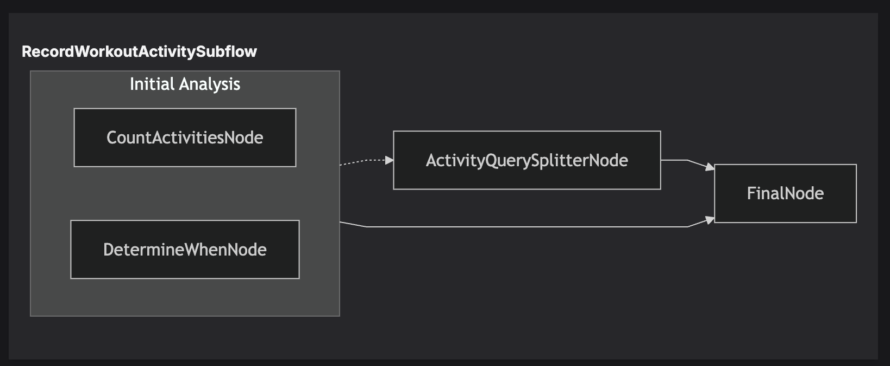

.. _concurrency:

##############################################################
Concurrency
##############################################################

.. meta::
   :description: Explore Junjo's powerful asyncio-native concurrency model for building high-performance Python workflows. Learn about immutable state and RunConcurrent for parallel task execution.
   :keywords: junjo, python, asyncio, concurrency, workflow execution, parallel processing, immutable state

Concurrency is key to fast and efficient execution of LLM powered AI workflows. 

Whether it's making several network API or LLM requests, processing data in parallel, or managing various I/O-bound operations. Junjo embraces concurrency as a core principle of workflow execution.

Junjo is designed from the ground up to leverage the power of Python's ``asyncio`` library, enabling you to build highly concurrent and efficient workflows. This page delves into how Junjo handles concurrency, its immutable state management, and the ``RunConcurrent`` utility for parallel task execution.

Asyncio Native: The Core of Junjo's Performance
================================================

Being "asyncio native" means Junjo is fundamentally built using Python's ``async`` and ``await`` syntax and leverages the ``asyncio`` event loop. This offers significant advantages:

*   **Non-Blocking Operations**: Asyncio allows Junjo to perform I/O-bound operations (like network requests or file system access) without blocking the main thread.
*   **Efficient Resource Utilization**: By avoiding thread-based parallelism for I/O-bound tasks, Junjo can handle many concurrent operations with lower overhead compared to traditional multi-threaded approaches.
*   **Seamless Integration**: You can easily integrate other asyncio-compatible libraries within your Junjo workflows.

Example: `RunConcurrent()`
----------------------------------

When defining your workflow's graph or subflow, you can easily execute nodes and subflows concurrently.

.. code-block:: python

  # Instantiate nodes
  count_activities = CountActivitiesNode()
  determine_when = DetermineWhenNode()
  activity_query_splitter = ActivityQuerySplitterNode()
  final_node = FinalNode()

  # Create a RunConcurrent instance, and specify the nodes to execute
  initial_analysis_node = RunConcurrent(
    name="Initial Analysis",
    items=[count_activities, determine_when]
  )

  # Define the graph structure
  record_workout_activity_graph = Graph(
    source=initial_analysis_node,
    sink=final_node,
    edges=[
        # Specify the RunConcurrent instance like any other Graph node
        Edge(tail=initial_analysis_node, head=activity_query_splitter, condition=IsMultipleActivities()),

        # Final transitions
        Edge(tail=activity_query_splitter, head=final_node),
        Edge(tail=initial_analysis_node, head=final_node),
    ]
  )

Example execution visualization:

This example demonstrates how `RunConcurrent` can be utilized to execute nodes in parallel. You can also execute entire `Subflow` instances in parallel.

All state updates made by these nodes are concurrency safe due to the immutable nature of state updates. **Junjo Server** allows you to step through state updates incrementally to see which nodes update state and when, even during high concurrency.

Immutable State: Ensuring Concurrency Safety
============================================

One of the challenges in concurrent programming is managing shared state. When multiple nodes attempt to modify the same piece of data simultaneously, it can lead to race conditions, data corruption, and unpredictable behavior.

Junjo addresses this by promoting **immutable state updates** via a **store** layer.

1.  **Stores define state update functions**: The store is responsible for managing the instance of state. Functions defined in the store safely act upon state, even in highly concurrent scenarios.
2.  **Nodes execute state update functions**: Nodes receive access to the store, and can get and set state.

The following state and store example demonstrates Junjo's redux-inspired state update pattern.

.. code-block:: python

  # store.py
  class SampleState(BaseState):
    data: str | None = None
    count: int = 0

  class SampleStore(BaseStore[SampleState]):
      async def set_data(self, payload: str) -> None:
          await self.set_state({"data": payload})

      async def set_count(self, payload: int) -> None:
          await self.set_state({"count": payload})

      async def increment(self) -> None:
        await self.set_state({"count": self._state.count + 1})

      async def decrement(self) -> None:
          await self.set_state({"count": self._state.count - 1})

  # node_set_data.py
  class SetDataNode(Node[SampleStore]):
    async def service(self, store: SampleStore) -> None:
        # Get the current state and maybe do something with it
        state = await store.get_state()

        # Get some data
        data = fetch_data()

        # Update the store with the data
        await store.set_data(data)
        return
  
  # node_increment.py
  class IncrementNode(Node[SampleStore]):
    async def service(self, store: SampleStore) -> None:
        await store.increment()
        return

  # node_decrement.py
  class DecrementNode(Node[SampleStore]):
    async def service(self, store: SampleStore) -> None:
        await store.decrement()
        return

The above nodes could be executed concurrently using `RunConcurrent`. Even when operating on the same state parameter, all set_state functions are concurrency safe.

This approach significantly simplifies reasoning about concurrent execution, as you don't have to worry about locks or other synchronization primitives for state access within your node logic. Each node's execution can be considered more isolated from a state mutation perspective.

Benefits of Junjo's Approach to Concurrency
===========================================

Junjo's concurrency model, combining asyncio-native design with immutable state and utilities like ``RunConcurrent``, offers several key benefits:

*   **Improved Performance and Throughput**: Efficiently handles I/O-bound tasks and allows for true parallelism, leading to faster workflow completion.
*   **Simplified Development**: Writing asynchronous code is natural with ``async/await``. Immutable state reduces the mental overhead of managing concurrent data access.
*   **Enhanced Reliability and Stability**: The risk of race conditions and state corruption is minimized, leading to more robust applications.
*   **Scalability**: Well-suited for building applications that need to handle a large number of concurrent operations or scale with increasing load.

Best Practices for Designing Concurrent Junjo Workflows
=======================================================

When designing concurrent workflows with Junjo, consider the following:

*   **Identify Independent Tasks**: Look for parts of your workflow that don't depend on each other's immediate output. These are good candidates for ``RunConcurrent``.
*   **Keep Nodes Focused**: Design nodes to perform specific, well-defined tasks. This makes it easier to reason about their concurrent behavior.
*   **Understand State Flow**: Be clear about what state each concurrent branch needs and what state it will produce. Junjo's immutable state helps, but clear design is still key.
*   **Handle Errors Gracefully**: In concurrent operations, individual tasks might fail. Ensure your workflow has appropriate error handling mechanisms for tasks running within ``RunConcurrent``.
*   **Profile and Optimize**: Use profiling tools to identify bottlenecks in your asynchronous workflows and optimize critical paths.

Conclusion
==========

Junjo provides a powerful and Pythonic framework for building concurrent directed graph workflows. Its asyncio-native architecture, immutable state updates, and features like ``RunConcurrent`` empower developers to create high-performance, scalable, and reliable Python workflow execution systems. By understanding and leveraging these concurrency features, you can unlock the full potential of Junjo for your complex processing needs.
