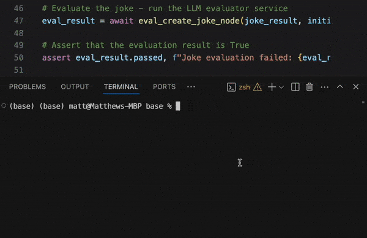

.. _eval_driven_dev:

Eval-Driven Development
=====================================

Eval-Driven Development (EDD) is a critical development strategy for applications powered by Large Language Models (LLMs). This practice places continuous and rigorous evaluation at the heart of the development lifecycle.

EDD accelerates complex workflow development by allowing one to iterate on their LLM prompts with many test inputs, and immediately see how the prompt changes impact the evaluation results.

*The above example demonstrates a simple pytest execution that gives pass / fail rates for a set of test inputs evaluating against a Junjo node.*

- Test individual nodes
- Test entire workflows
- Just use **pytest**
- No third party tools or platforms are required - everything happens directly in your codebase

Pytest executions can initialize an input state for the node, and analyze the results after the node executes its set_state updates.

Library Example
~~~~~~~~~~~~~~~~~~~~~~~

Check out :code:`src/base/sample_workflow/sample_subflow/nodes/create_joke_node/test` to see an example eval system, setup to evaluate the joke created. 

- It uses a combination of asserts and live LLM evaluations
- This example uses Gemini to evaluate the results of the `create_joke_node` against several test inputs inside `test_cases.py`
- The eval has a prompt inside `test_prompt.py`
- `test_node.py` executes the pytest test
- The live `node.py` LLM call is executed to generate the result and state update for evaluation
- Test failures include reasons why the prompt failed to generate output that passed the evaluation. See the `test_schema.py`.

On mission critical workflows, this setup can be used to orchestrate hundreds or thousands of test inputs against a prompt to ensure it covers all use cases well.

Testing Model Changes
~~~~~~~~~~~~~~~~~~~~~~~

This is also a great way to evaluate whether changing LLM models increases or decreases eval pass / fail rates, or changes the speed at which evals are completed.

