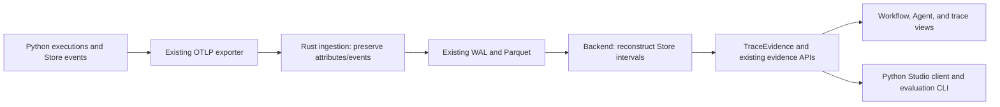

# Composable Agent application Stores: end-to-end change map

Status: implemented and validated under [accepted ADR 0016](../adr/0016-composable-application-stores.md). Query tail-latency comparison limits are recorded in the evidence report.
Baseline audited on 2026-09-20 at repository revision `1faadb5`. This map records
the implemented scope and its original rationale; validation evidence is retained
in [the implementation report](evidence/composable-stores-2026-09-20/README.md).

## Outcome and scope

Support both application choices explicitly:

- An Agent creates an application Store for its execution using a factory.
- An Agent uses a live application Store supplied by its caller. A Workflow
  can use that same Store, including when invoked by an Agent Tool.

Both use the existing `BaseState` / `BaseStore` conventions. Private Agent
bookkeeping stays independent per invocation: transcript, counters, pending
Tools, usage, limits, and terminal outcome are not application state.

Subflows keep their current fresh Store and `pre_run_actions` /
`post_run_actions` input/output mapping. Sharing application state does not
share execution identity, Graph instances, counters, or hook registrations.

This implementation includes SDK execution changes, a coordinated telemetry contract change,
backend evidence changes, frontend projection/selection changes, and docs.
The ingestion/storage architecture does not need to change.

| Surface | Required work | Keep unchanged |
| --- | --- | --- |
| Python Agent | Typed application Store configuration, execution argument, Tool access, detached result state | Model loop, private runtime Store, model protocol, Tool scheduling |
| Python Workflow | Explicit borrowed Store execution; execution-local lifecycle context | Fresh Graph per run, graph traversal, conditional edges, Subflow isolation |
| Store evidence / contract | Per-execution Store boundaries; distinguish application and runtime roles | Store IDs, ordered mutation events, RFC 6902 patches, payload policy semantics |
| Rust ingestion | Exercise new evidence through existing transport/storage tests | OTLP ingestion, WAL, Arrow/Parquet columns, hot snapshots, internal gRPC |
| Backend | Reconstruct execution intervals and represent multiple Store relationships | Physical trace queries, SQLite metadata architecture, evaluation persistence |
| Frontend | Application/runtime state distinction; select execution-specific Store views | Existing pages, Redux ownership, raw trace source, Graph renderer |
| Python Studio client / CLI / evaluation | Update affected DTOs and invocation pass-through; verify evidence commands | CLI commands, evaluation execution model, stored datasets/attempts |
| Documentation / examples | Explain both patterns and publish a visible native OpenAI example | Provider ownership and application-specific deployment responsibilities |

## 1. Python public API and composition

The implemented public API follows ADR 0016. Agent types are
`Agent[Input, Output, Dependencies, State, Store]`; Tool contexts are
`AgentRunContext[Dependencies, Store]`.

| Boundary | Implemented behavior |
| --- | --- |
| `Agent(..., store_factory=create_store)` | Factory creates the application Store when no Store is supplied to `execute`. Follow the Workflow factory convention. |
| `agent.execute(input, dependencies=deps, store=store)` | Use the exact supplied Store; do not invoke the factory or copy/reset the Store. |
| `AgentRunContext.store` | The invocation's typed application Store, available to Tool services. Never expose private Agent runtime state through this field. |
| `workflow.execute(store=store)` | Use the supplied application Store while creating a fresh Graph and independent execution context. |
| Agent result | Include a detached, typed application-state snapshot separately from `output`, transcript, and usage. The fields are `application_state` and `application_store_id`. |
| Agent without an application Store | Remains supported without manufacturing an empty domain Store. Tool context typing must reflect absence. |

A supplied Store also works when the Agent has no factory. Shared compositions
must accept the same Store contract; compositions with different state shapes
can use separate Stores and explicit mappings. No automatic parent-Store
injection or Store/schema conversion is required.

Do not use `parent_store` to mean a borrowed execution Store. In current
Subflows it is the parent side of an isolated mapping boundary. An explicit
`store=` argument has a different meaning. Keep the Subflow public path
isolated rather than accidentally exposing borrowing through the shared base
class in `workflow.py`.

Application code still owns mappings:

| Composition | Inputs | Outputs |
| --- | --- | --- |
| Workflow calls Agent with separate Stores | Node reads Workflow state and passes typed Agent input; application configures the Agent's initial Store | Node maps `result.output` and selected application-state fields into Workflow Store actions |
| Workflow calls Agent with the same Store | Node passes `store=store`; typed Agent input still states the requested task | Tool Store actions are already visible; Node explicitly commits final model output if it wants that output in state |
| Agent Tool calls Workflow with separate Stores | Tool maps validated arguments into the Workflow's initialization | Tool maps `ExecutionResult.state` into its return value and, if desired, Agent Store actions |
| Agent Tool calls Workflow with the same Store | Tool passes `store=context.store` | Workflow actions are already visible; Tool separately returns the model-facing result |
| Subflow | Existing `pre_run_actions(parent_store, subflow_store)` | Existing `post_run_actions(parent_store, subflow_store)` |

Store contents do not automatically become model prompt content. Typed Agent
input and Tool results continue to determine what the model receives.

**Owning files:** [Agent definition](../../sdks/python/src/junjo/agent/definition.py),
[runtime](../../sdks/python/src/junjo/agent/_runtime.py),
[Tool/context](../../sdks/python/src/junjo/agent/tool.py),
[result](../../sdks/python/src/junjo/agent/result.py),
[errors](../../sdks/python/src/junjo/agent/errors.py),
[Workflow](../../sdks/python/src/junjo/workflow.py), and their public exports,
docstrings, typing fixtures, and
[public-surface inventory](../../sdks/python/docs/api-public-surface.json).

Carry the concrete Store type through Agent and Tool context, and the state
type through results. Avoid losing custom Store actions behind `Any` or adding
another dependency container. Preserve existing runtime-diagnostic snapshot
semantics; do not silently repurpose `AgentStateSnapshot` or existing error
state as application state. Failure/cancellation evidence must distinguish
these domains and include an application snapshot when one was captured.
Keep existing boundary validation, causal exceptions, and cancellation behavior.

## 2. Execution context and concurrency

This is the necessary internal change beyond adding parameters.

At the audited baseline, [BaseStore](../../sdks/python/src/junjo/store.py) stored one mutable
`_lifecycle_context`. [Workflow](../../sdks/python/src/junjo/workflow.py)
set it; [Node](../../sdks/python/src/junjo/node.py),
[RunConcurrent](../../sdks/python/src/junjo/run_concurrent.py), and Store
actions read it. This implementation replaces that mutable association. Two executions borrowing one Store would overwrite each
other's dispatcher and Graph identity. A nested execution can also leave the
parent using the child's context.

Move execution identity/dispatch context out of the Store into private
execution-local context. Keep graph-specific compiled Node identities with
the active Graph execution. A task-local scoped context is a suitable small
implementation; it must be installed/restored through success, failure, and
cancellation and distinguish the actual Store being mutated.

Required behavior:

- Concurrent borrowers retain separate run IDs, Graphs, counters, and hook
  dispatcher snapshots. The Store retains only state, its existing commit
  lock, identity, and Store evidence mechanics.
- Agent execution must not accidentally reuse an enclosing Workflow's
  compiled Node lookup when a Tool executes a different Node or Workflow.
- Subflow pre/post actions can still update either Store with correct
  attribution. The active child context must not relabel the parent's Store.
- Private Agent Store mutations must not start firing Workflow application
  state-change hooks because a context is now ambient.
- Preserve hook registration snapshotting and observer error/cancellation
  handling in [the lifecycle layer](../../sdks/python/src/junjo/_lifecycle.py).
  Sharing a Store does not inherit or broadcast hook subscriptions.

ADR 0016 makes the narrow hook decision: existing
[`StateChangedEvent`](../../sdks/python/src/junjo/hooks.py) requires Graph
identity. Agent lifecycle payloads now include distinct application Store
metadata alongside their private runtime Store metadata.
Preserve existing graph state-change behavior. An Agent application-state
callback is not required for telemetry or sharing; do not add one or broaden
every Graph event solely to implement this feature. If exposing the existing
`on_state_changed` hook to standalone Agents is desired, specify its truthful
non-Graph payload in the ADR as an explicit additional API change.

Keep the existing `BaseStore` commit lock. Model calls, Tool services, Workflow
execution, and observers must not run while holding it. Two operations may
read the same snapshot and later replace the same field; last committed
replacement wins. No conflict detector, reducer API, automatic merge,
transaction, rollback, or concurrency cap is needed.

`RunConcurrent` currently accepts Nodes and Subflows. Its Nodes can invoke
Agents or Workflows with the same Store; `asyncio.gather` can also invoke the
public APIs. Direct Agent/Workflow membership in a Graph or `RunConcurrent`
is a separate feature, not a prerequisite.

## 3. Store evidence: distinguish instance lifetime from execution interval

The existing Store already has stable identity, ordered transition sequence,
revision-before/after, action name, event identity, and JSON Patch. Reuse them.
Do not emit a second copy of a mutation on the parent or every borrower.

The baseline [evidence tracker](../../sdks/python/src/junjo/telemetry/store_evidence.py)
assumed a Store's whole lifetime was one execution: start revision zero,
sequence `1..count`, and replay from construction. A borrowed execution can
start after earlier writes and finish while other borrowers continue.

Represent an execution's use of a Store with these facts:

| Fact | Meaning |
| --- | --- |
| Store ID | Identity of the live instance; the same across borrowers |
| Executable span/run identity | The execution observing this interval |
| Role | Application state or private Agent runtime state |
| Start/end snapshots | State at this execution's boundaries |
| Start/end sequence positions | All Store transitions in `(start_sequence, end_sequence]` |
| Start/end revisions | Live state versions at those boundaries |
| Transition count / reconstruction facts | Evidence for that interval, with the existing policy/integrity distinctions |

Sequence positions are necessary in addition to revisions: a no-op Store
action records a transition without incrementing the revision.

For example, a Workflow can observe application Store `S` over sequence
positions `0 → 9`, its Agent over `2 → 7`, and a Workflow Tool over `4 → 6`.
The Agent separately owns runtime Store `R`, starting at zero. A sibling's
write to `S` at sequence 5 belongs in all three overlapping application-state
views, but is emitted once and attributed to that sibling's span.

Capture the typed state snapshot, serialized projection, revision, and sequence
at each boundary under one existing Store lock. Workflow terminal collection
now captures result state and telemetry evidence together, replacing the
baseline's two separate lock acquisitions. Finish only this invocation's interval; never reset, close,
or finalize the live Store for other borrowers.

Use the interval's starting checkpoint and transition slice for replay.
Do not replay the Store's entire prior lifetime for every nested execution.
The baseline retained all historical patches. The implemented tracker drops
history no active execution boundary needs. Scope temporary replay evidence to the boundaries that still need
it, while preserving monotonic Store sequence/revision counters. Select the
smallest implementation after the baseline measurements below; no arbitrary
history limit, content truncation, background cleanup service, or persistent
Store event database is needed.

Each `set_state` event remains attached to its actual current OTel span.
For a shared interval, replay includes all observed writes to that Store in
the interval, including nested and sibling writes. Do not present the interval
as a list of changes exclusively made by the selected Agent.

Store sharing does not require identical trace ownership. A start checkpoint
allows a later execution to begin at a nonzero position without loading older
traces. If a concurrent mutation inside the interval is unrecorded or appears
only in another trace, this trace cannot prove complete replay: retain its
emitted boundary snapshots and report incomplete evidence. Do not forbid the
runtime pattern, invent missing events, or add cross-trace Store indexing as
part of this change.

## 4. Telemetry contract and conformance

Telemetry contract **3** coordinates the ownership and boundary changes.
[ADR 0016](../adr/0016-composable-application-stores.md) specifies the exact
wire names; [ADR 0006](../adr/0006-agent-telemetry-contract.md) retains the
private runtime and payload contracts.

Keep private Agent state/operation attributes meaning what they mean today.
Add a separate application Store boundary on Agent spans, and extend the
Workflow boundary with interval positions. Parameterize boundary readers
rather than globally renaming model/Tool evidence. Existing transition events
can retain their attribute names and patch format; Store role follows from
the executable's Store references, not an extra copy of the event.

Coordinate:

- [Contract VERSION](../../contracts/telemetry/VERSION), affected canonical
  schemas, contract documentation, validator, and generated fixtures.
- SDK [contract constant](../../sdks/python/src/junjo/telemetry/otel_schema.py)
  and emitters; producer-equivalence tests.
- Backend [active-version handling](../../apps/studio/backend/app/features/telemetry_contract/scalars.py)
  and diagnostics. Also update the hard-coded version checks in
  [execution resolution](../../apps/studio/backend/app/features/execution_resolution/service.py).
- Generated backend projections and frontend contract fixtures, including
  mixed native Junjo / OpenInference / external-framework traces.

Do not change model request/response schemas, usage semantics, Graph snapshot
format, or Agent/Tool fingerprint algorithms just to add a live Store. A Store
instance ID or its contents must never enter a definition fingerprint.
Adding an application schema to definition fingerprints would be a separate
behavior-identity decision, not required for Store sharing.

Keep the existing coordinated active-version policy. Describe the SDK/Studio
release pairing and unsupported-version behavior. This proposal does not add
dual emitters, compatibility adapters, historical data migration, or a
second transport contract. The raw [events JSON contract](../../apps/studio/docs/adr/004-events-json-contract.md)
and external OpenAI Agents integration payload contract stay unchanged.

## 5. Rust ingestion, storage, and backend queries

**No production ingestion change is indicated by the audit.**
[SpanRecord conversion](../../apps/studio/ingestion/src/wal/span_record.rs)
preserves arbitrary span attributes and event attribute maps. The
[Arrow schema](../../apps/studio/ingestion/src/wal/schema.rs) stores those as
JSON strings. Ingestion does not enforce executable-to-Store ownership.

Add/extend coverage proving the new producer evidence survives OTLP conversion,
WAL, hot-snapshot Parquet, cold Parquet, and backend reads with exactly one copy
of each original event. Exercise hot/recent-cold overlap through existing query
coverage. Reuse the current fixture/harness paths.

Leave these production surfaces unchanged:

- [Trace service](../../apps/studio/ingestion/src/server/trace_service.rs),
  batching, background flush, acknowledgement, recovery, backpressure, and auth.
- [Internal ingestion proto](../../apps/studio/proto/ingestion.proto), other
  protobuf transports, Arrow/Parquet columns, and deployment configurations.
- [Metadata extraction](../../apps/studio/backend/app/features/parquet_indexer/parquet_reader.py)
  and SQLite tables/indexes: their job remains finding files by trace/service.
- [Trace evidence repository](../../apps/studio/backend/app/features/trace_evidence/repository.py)
  and [physical span queries](../../apps/studio/backend/app/features/otel_spans/repository.py):
  the existing complete-trace read supplies sibling evidence.

These boundaries follow the accepted
[WAL](../../apps/studio/ingestion/adr/001-segmented-wal-architecture.md) and
[metadata-index](../../apps/studio/ingestion/adr/002-sqlite-metadata-index.md)
decisions. No Store coordination belongs in ingestion.

## 6. Backend interpretation and API

### Reconstruction and Agent diagnostics

Update [shared reconstruction](../../apps/studio/backend/app/features/store_diagnostics/reconstruction.py)
and its [schemas](../../apps/studio/backend/app/features/store_diagnostics/schemas.py)
to accept nonzero sequence/revision starts and validate the declared interval.
Filter by Store ID and sequence position, not timestamps or descendant status.
Preserve missing/duplicate-event, revision, patch-replay, dropped-evidence,
redaction, exclusion, and reference-payload diagnostics.

[Workflow diagnostics](../../apps/studio/backend/app/features/workflow_diagnostics/assembler.py)
already gathers Store events across the trace; restrict replay to the selected
execution's interval instead of the entire Store event list.

[Agent diagnostics](../../apps/studio/backend/app/features/agent_diagnostics/assembler.py)
currently restricts its private Store to the Agent owner and its model/Tool
operations, and validates transcript/action causality. Preserve those checks
for runtime state. Reconstruct application state separately using the shared
Store rules. Do not relax runtime validation to accommodate application writes.
Model/Tool operation revision fields continue to refer to private runtime
state unless an additional application checkpoint is explicitly designed.

### TraceEvidence, manifests, and selected spans

The replaced baseline assumptions were in
[TraceEvidence schemas](../../apps/studio/backend/app/features/trace_evidence/schemas.py)
and [assembler](../../apps/studio/backend/app/features/trace_evidence/assembler.py):

- Executables have one `store_id`.
- `stores_by_id` holds one `owner_span_id` and one `StoreDetail` per Store.
- A second execution referring to the same Store becomes `duplicate_store_identity`.
- Manifest and selected-span projections look up a Store by its sole owner.

Replace that one-to-one relationship with explicit executable Store references
and execution-specific views. A minimal shape keeps `stores_by_id` for physical
Store identity, and gives each executable role-labelled references whose
boundary/detail is identified by executable span plus role. The implemented `executable.stores[role]` holds checkpoints, interval, and
verification; `stores_by_id` retains physical transitions once. No new UUID or
database entity is needed.

Repeated application Store references are valid. Distinct runtime Store
ownership remains enforced. Expose which execution/role a diagnostic describes;
Store ID alone cannot select its start/end state. Avoid multiplying complete
transition payloads for every borrower when references to trace-level evidence
can serve the same consumers. Index Store events once during assembly rather
than rescanning all events for each execution.

Update the existing trace, attempt full-evidence, manifest, and selected-spans
responses together. Manifests must expose both Agent roles and shared usage;
selected evidence must identify the relevant execution interval. Retain raw
span/event identity so a caller can retrieve a transition's actual carrier.
No new route is needed.

Regenerate [OpenAPI](../../apps/studio/frontend/backend/openapi.json) through
the [export script](../../apps/studio/backend/scripts/export_openapi_schema.py)
and run [REST contract validation](../../apps/studio/backend/scripts/validate_rest_api_contracts.sh).
Do not change evaluation persistence, dataset schemas, authentication, or
execution identity merely because response projections change.

## 7. Frontend surfaces

Keep the single authoritative TraceEvidence document and backend-verified
replay. Required changes are concentrated in these consumers:

| Surface / owning source | Change |
| --- | --- |
| [TraceEvidence Zod schemas](../../apps/studio/frontend/src/features/traces/schemas/trace-evidence.ts), shared Store schemas | Match role references and execution interval details; strict parsing remains |
| [Agent selectors](../../apps/studio/frontend/src/features/agent-executions/store/selectors.ts) and detail schema | Project runtime and optional application state separately |
| [Agent detail](../../apps/studio/frontend/src/features/agent-executions/components/AgentExecutionDetailView.tsx) / [state timeline](../../apps/studio/frontend/src/features/agent-executions/components/AgentStateTimeline.tsx) | Label application state and runtime state clearly; show shared identity and actual writer; reuse current timeline/diff rendering |
| [Workflow diagnostic hook](../../apps/studio/frontend/src/features/workflow-executions/hooks/use-workflow-store-diagnostic.ts) | Select by execution and role, not Store ID alone |
| [Active Store diagnostic](../../apps/studio/frontend/src/features/junjo-data/workflow-detail/use-active-workflow-store-diagnostic.ts) / [trace selectors](../../apps/studio/frontend/src/features/traces/store/selectors.ts) | Remove the first-Workflow-with-this-Store-ID lookup; maintain explicit selected execution/interval |
| [Workflow state diff](../../apps/studio/frontend/src/features/junjo-data/workflow-detail/WorkflowDetailStateDiff.tsx), state navigation, [page route selection](../../apps/studio/frontend/src/features/junjo-data/workflow-detail/WorkflowDetailPage.tsx) | Keep exact event/carrier selection valid for nested and sibling writes; use the chosen boundary for before/after state |
| Raw trace tree, span details, Graph highlighting | Verify actual carrier attribution and existing links; change only assumptions that require unique Store ownership |
| Evaluation evidence views / generated fixtures | Consume the same updated evidence document and summaries |

Specific behavior to preserve or correct:

- No application Store is a valid Agent configuration, not an admission failure.
- A shared Store's end snapshot is the selected invocation's checkpoint,
  not the latest state another execution happened to publish.
- Timeline selection must reset on execution/role changes even when Store ID
  stays the same. The baseline reset only on Store ID; the implementation also
  keys the panel by execution and role.
- A sibling mutation can belong to the interval without being a descendant of
  the selected Workflow. Current Workflow routes reject non-descendant spans.
  Keep that route validation; link an external carrier to its existing trace
  detail (or actual owning execution), and retain the selected state interval
  while inspecting its transition. Do not insert it into the wrong Graph.
- Preserve Subflow parent-Store events: event Store identity can differ from
  the selected Subflow's own Store.
- Keep the existing event identity `(store, span, event, sequence)`; timestamps
  do not decide order and raw events are not duplicated.

Follow the existing
[Redux ownership](../../apps/studio/docs/adr/002-redux-toolkit-listener-middleware-pattern.md)
and [selection](../../apps/studio/docs/adr/008-workflow-graph-exploration-and-selection.md)
contracts. No new global frontend Store, client-side replay engine, polling
system, dashboard, or visual redesign is required.

## 8. SDK integrations, evaluations, and coding-agent evidence

These are real API consumers, not optional follow-up audits:

- [Evaluation targets/invocations](../../sdks/python/src/junjo/evaluation/targets.py):
  carry the optional supplied Store into Agent/Workflow execution and preserve
  result typing. Case factories decide whether to create or supply state.
  Keep cleanup, correlation, real execution, and result projection unchanged.
  Verify the existing Node target harness against the context refactor.
- [OpenAI Agents SDK Tool adapters](../../sdks/python/src/junjo/plugins/openai_agents/_tools.py):
  allow their invocation objects to forward the same explicit Store choice.
  Remove descriptions that unconditionally require isolated application Stores.
  Keep external Agent instrumentation and framework identity independent.
- [Python Studio DTOs](../../sdks/python/src/junjo/studio/models.py): update the
  typed executable/Store manifest summaries. The full-evidence DTO preserves
  nested JSON, but any envelope change still needs coordinated parsing/docs.
- [CLI evidence commands](../../sdks/python/src/junjo/cli/main.py): verify
  manifest, selected spans, and full evidence faithfully expose both roles.
  Existing command names and transport calls can remain. The doctor output
  already reads the SDK telemetry-version constant; verify its reported
  compatibility information after the version change.
- Existing `ai_chat` and `base_openai_agents` examples: adjust affected Agent,
  context, result, and invocation type signatures. Their current separate-Store
  application behavior can stay as it is; do not convert them to sharing as
  a side effect of making sharing available.
- Packaged evaluation/integration skills and generated API reference: replace
  unconditional isolation language and teach callers to inspect role and
  interval when investigating Store evidence.

No Studio-hosted execution, evaluation scheduler, persistent Agent memory, or
new external framework adapter is part of this work.

## 9. Documentation, discovery, and the OpenAI example

Update source-owned documentation, not staged/generated website pages:

- [Agents](../../sdks/python/docs/content/docs/python/agents/index.md) and
  [composition](../../sdks/python/docs/content/docs/python/agents/composition.md):
  present the two choices side by side with both invocation directions and
  explicit input/output mapping. Remove statements forbidding live sharing.
- [State](../../sdks/python/docs/content/docs/python/workflows/state.md),
  [concurrency](../../sdks/python/docs/content/docs/python/workflows/concurrency.md),
  and [Subflows](../../sdks/python/docs/content/docs/python/workflows/subflows.md):
  distinguish Store lifetime, invocation lifetime, detached snapshots, and
  existing isolated Subflow mapping. Explain replacement semantics without
  prescribing a universal isolation/sharing policy.
- [OpenTelemetry](../../sdks/python/docs/content/docs/observability/opentelemetry.md):
  application versus runtime state, interval reconstruction, and a practical
  OpenAI Python SDK + OpenInference configuration using the application's
  common telemetry initialization and actual Studio exporter.
- Model-driver and external OpenAI Agents integration docs: clearly distinguish
  a native Junjo Agent calling `openai-python` from an external OpenAI Agent.

Create the agreed `sdks/python/examples/junjo_openai_sdk` example:

1. Typed application State/Store with meaningful named actions.
2. Native Junjo Agent using OpenAI SDK calls through a ModelDriver.
3. A Tool that invokes a Workflow with a conditional edge and an explicit
   supplied Store; explain the separate-Store variant beside it.
4. Another Tool that invokes a Node through `Node.execute`, with no one-Node
   Workflow wrapper and no direct call to `Node.service`.
5. OpenInference instrumentation of the provider client using the same OTel
   provider/exporter as native Junjo telemetry.
6. One shared initialization path for running and diagnostics, complete
   configuration/dependency instructions, and an explicitly invoked live smoke
   test. Deterministic tests must not depend on paid provider calls.
7. README showing the debugging benefit: which action changed which field,
   the state that led to a conditional branch, the actual writer, and the
   model/Tool operation around it. Identify both state roles in Studio.

Publish a canonical examples-and-integrations index with runtime, provider SDK,
instrumentor, composition pattern, prerequisites, and runnable example links.
Link it from the root/SDK READMEs, Python landing page, docs landing/navigation,
Agent/model-driver/telemetry guides, and the example README. Include it in the
existing docs assembly/search output and any existing LLM-oriented export;
do not introduce another manually maintained copy of the same guide.

Update [the copyable setup prompt](../../apps/website/src/data/agent-setup.md)
to direct readers to the index and the relevant deployment, native Agent,
composition, model-driver, and OpenInference pages before implementing.
This improves discoverability; it cannot guarantee what an LLM will read.

Blender checks, image-provider readiness, task workers/observers, and another
application's runbook remain that application's responsibility.

## 10. Delivery order and validation

Implement in dependency order, keeping each change reviewable:

1. **Approve the narrow contracts.** Amend the affected decisions in root
   ADRs [0003](../adr/0003-agent-execution-model.md),
   [0004](../adr/0004-agent-model-driver-and-tool-contracts.md),
   [0005](../adr/0005-agent-workflow-composition.md),
   [0006](../adr/0006-agent-telemetry-contract.md), and Studio
   [007](../../apps/studio/docs/adr/007-agent-execution-diagnostics.md).
   Record any selection consequences in Studio ADR 008. Inspect evaluation
   and external-integration ADR references for isolation wording; revise only
   statements affected by this change. Settle public state names/types, wire
   boundary fields, and hook routing without silently expanding hook scope.
2. **Capture the unchanged baseline.** Use the supported resource profiles and
   workloads in [SDK benchmarks](../../sdks/python/benchmarks/README.md) and
   [Store/ingestion evidence](evidence/studio-store-ingestion-2026-09-06/README.md).
   Add representative shared/successive execution workloads to compare
   context overhead, boundary capture, patch retention, and replay cost.
3. **SDK and canonical evidence.** Implement application Store access,
   borrowed Workflow execution, scoped context, and interval evidence
   together. Preserve Subflow behavior. Extend invocations and typing.
4. **Backend and API consumers.** Reconstruct both roles, update cohesive
   evidence/manifests/selection, regenerate OpenAPI, and update SDK DTOs.
   Exercise new fixtures through unchanged ingestion/storage.
5. **Frontend and runnable documentation.** Update projections and exact
   selection behavior using the same fixtures; add the example/index/guides.
6. **Validate and coordinate release.** Ship only after all producer/consumer
   surfaces pass against the chosen contract. No independently claimed
   compatibility based on one component's tests.

### Behavior matrix

| Scenario | Required evidence |
| --- | --- |
| Agent with factory-created application Store | Typed Tool actions, detached result snapshot, separate runtime state |
| Agent without application Store | Existing behavior; absence represented correctly in API/UI |
| Agent with supplied Store; definition also has a factory | Exact object is used; factory not called |
| Workflow → Agent and Agent → Workflow, both Store choices | Correct mappings, identities, model-facing results, and no implicit copyback |
| Concurrent Agents and Workflows on one Store | Isolated execution contexts, existing write semantics, ordered single-copy events |
| Sequential reuse after prior mutations, including a no-op | Nonzero start positions and correct interval replay; expired replay history not retained unnecessarily |
| Failure or cancellation of one borrower while another continues | Only that invocation closes; no rollback/reset of live Store; coherent terminal snapshots |
| Subflow pre/post actions modifying parent and child | Existing isolated semantics, correct action attribution and state navigation |
| Direct Node Tool inside Agent inside Workflow | No one-Node wrapper or inherited Graph lookup failure |
| Shared interval includes sibling or nested writes | Backend replay uses all relevant events; UI shows real carrier, no fabricated Graph membership |
| Missing/dropped/redacted/excluded evidence | Existing honest partial/policy status; no fabricated complete replay |
| Later trace reuses Store; another trace writes concurrently | Start checkpoint works without old history; unavailable in-interval events produce explicit gaps |
| Evaluation/CLI and external Tool wrapper | Supplied Store passes through; manifest/selected/full evidence all expose correct roles/intervals |
| OpenAI + OpenInference example | Native state/operations and provider spans appear together through shared initialization |

Extend existing tests and conformance fixtures for these behaviors; do not
duplicate the entire Agent failure matrix for every Store option. Use ordinary
representative failure/cancellation paths plus targeted boundary-capture and
context-restoration tests.

Required area validation during implementation:

- SDK: Ruff, pytest, ty, Griffe public-surface validation, package build, Twine.
- Contracts: update the current fixture generator/validator, regenerate,
  validate, and prove a second generation leaves the tree unchanged; run
  producer and consumer conformance.
- Studio: `apps/studio/run-all-tests.sh`, REST/OpenAPI checks, generated
  projection parity, ingestion round-trip and complete hot/cold delivery tests.
- Docs/website: source-owned export, root assembly/parity, and the prescribed
  website install/build/validation commands.
- Performance: measure completed work, latency, CPU, and peak memory on the
  same supported resources. Include simultaneous ingestion/queries when
  assessing evidence size and Studio performance; count delivered spans, not
  only generated spans. Do not claim high-concurrency throughput from unit
  tests or change resources/acceptance gates to conceal a regression.

See the [implementation validation and performance report](evidence/composable-stores-2026-09-20/README.md)
for completed checks, raw measurements, and their limits. The original audit
was read-only; implementation and validation follow the accepted map above.
