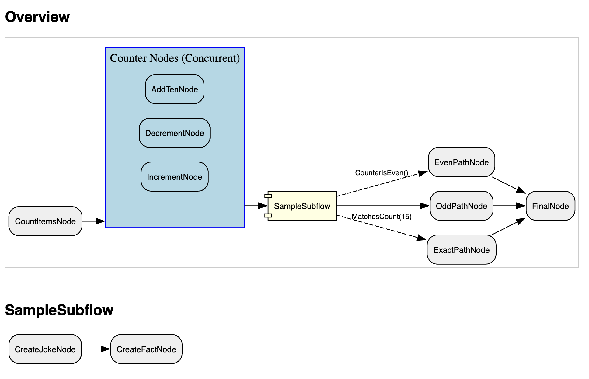
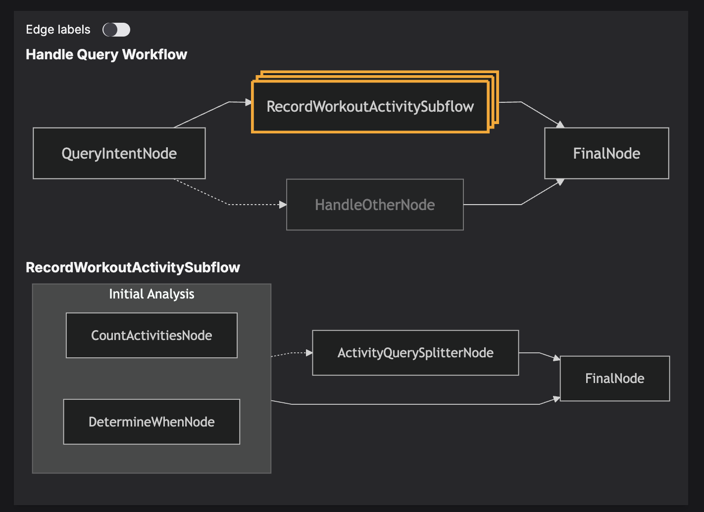

.. _subflows:

##############################################################
Subflows
##############################################################

.. meta::
   :description: Learn how to implement and use Subflows in Junjo to create modular, reusable, and organized Python workflows. Discover how the Graph class simplifies complex workflow construction.
   :keywords: junjo, python, workflow, subflow, modular design, graph, state management, reusable components

Junjo's `Subflow` allows you to encapsulate a sequence of operations into a reusable unit, promoting modularity and simplifying complex workflow designs. A Subflow is essentially a workflow nested within another workflow (or another Subflow), complete with its own isolated state and internal graph structure.

This page will guide you through implementing Subflows and integrating them into larger workflows using Junjo's `Graph` class.

What is a Subflow?
==================

A Subflow in Junjo is a specialized workflow that:

1.  **Executes within a parent workflow** (or parent Subflow).
2.  Maintains its **own isolated state and store**, ensuring that its internal operations do not directly interfere with the parent's state, except through explicitly defined interactions.
3.  Can **interact with its parent workflow's state** before its execution begins (via `pre_run_actions`) and after it completes (via `post_run_actions`).
4.  Has its **own `Graph` instance** defining its internal sequence of nodes and edges.
5.  **Is concurrency safe**: Multiple subflows can be executed concurrently with safe immutable state updates.

This design allows you to break down complex processes into smaller, manageable, and testable parts that can be executed concurrently.

Examples
========

Check out the following example applications for subflow implementations.

- `Base Example Graph With Subflow <https://github.com/mdrideout/junjo/blob/main/examples/base/src/base/sample_workflow/graph.py>`_
- `AI Chat with multiple layers of Subflows <https://github.com/mdrideout/junjo/blob/main/examples/ai_chat/backend/src/app/workflows/handle_message/graph.py>`_

Implementing a Subflow
======================

To create a Subflow, you'll define a class that inherits from `junjo.Subflow`. This class requires type parameters for its own state and store, as well as for the parent workflow's state and store. You'll also need to implement two abstract methods: `pre_run_actions` and `post_run_actions`.

Key Components:
---------------
*   **`Subflow[SubflowStateT, SubflowStoreT, ParentStateT, ParentStoreT]`**: The base class with generic type hints. These improve the developer experience when interacting with the subflow's store, and the parent store.
*   **`pre_run_actions(self, parent_store: ParentStoreT)`**: Executed before the Subflow's internal graph starts. Use this to fetch necessary data from the parent workflow's store and initialize the Subflow's state.
*   **`post_run_actions(self, parent_store: ParentStoreT)`**: Executed after the Subflow's internal graph completes. Use this to pass results or updated data from the Subflow's store back to the parent workflow's store.

Example Subflow Definition:
---------------------------

Let's consider a `SampleSubflow` that takes some items from a parent workflow, processes them (e.g., fetches a joke and a fact related to them), and then updates the parent workflow with these results.

First, define the states and stores for both the Subflow and its potential parent:

.. code-block:: python

  # subflow_store.py
  from junjo import BaseState, BaseStore

  class SampleSubflowState(BaseState):
      items: list[str] | None = None
      joke: str | None = None
      fact: str | None = None

  class SampleSubflowStore(BaseStore[SampleSubflowState]):
      async def set_items(self, items: list[str]) -> None:
          await self.set_state({"items": items})

      async def set_joke(self, joke: str) -> None:
          await self.set_state({"joke": joke})

      async def set_fact(self, fact: str) -> None:
          await self.set_state({"fact": fact})

  # parent_workflow_store.py (simplified for context)
  class SampleWorkflowState(BaseState):
      items: list[str] = ["default item"]
      joke_from_subflow: str | None = None
      fact_from_subflow: str | None = None

  class SampleWorkflowStore(BaseStore[SampleWorkflowState]):
      async def set_joke(self, joke: str) -> None:
          await self.set_state({"joke_from_subflow": joke})

      async def set_fact(self, fact: str) -> None:
          await self.set_state({"fact_from_subflow": fact})

Now, implement the `SampleSubflow`:

.. code-block:: python

  # sample_subflow.py
  from junjo import Subflow, Graph # Assuming Node, Edge are also imported
  from .subflow_store import SampleSubflowState, SampleSubflowStore
  from ..store import SampleWorkflowState, SampleWorkflowStore # Parent's store

  # Define some simple nodes for the subflow's internal graph
  # (These would typically be in their own files)
  from junjo import Node

  class GetJokeNode(Node[SampleSubflowStore]):
      async def service(self, store: SampleSubflowStore) -> None:
          # In a real scenario, fetch a joke based on store.items
          await store.set_joke("Why don't scientists trust atoms? Because they make up everything!")
          print("Subflow: GetJokeNode executed")

  class GetFactNode(Node[SampleSubflowStore]):
      async def service(self, store: SampleSubflowStore) -> None:
          # In a real scenario, fetch a fact
          await store.set_fact("Honey never spoils.")
          print("Subflow: GetFactNode executed")

  class SampleSubflow(Subflow[SampleSubflowState, SampleSubflowStore, SampleWorkflowState, SampleWorkflowStore]):
      async def pre_run_actions(self, parent_store: SampleWorkflowStore) -> None:
          parent_state = await parent_store.get_state()
          items_from_parent = parent_state.items
          await self.store.set_items(items_from_parent)
          print(f"Subflow: pre_run_actions executed, received items: {items_from_parent}")

      async def post_run_actions(self, parent_store: SampleWorkflowStore) -> None:
          subflow_state = await self.get_state()
          if subflow_state.joke is None or subflow_state.fact is None:
              raise ValueError("Subflow did not produce a joke and fact.")
          
          await parent_store.set_joke(subflow_state.joke)
          await parent_store.set_fact(subflow_state.fact)
          print("Subflow: post_run_actions executed, updated parent store.")

  # Instantiate nodes for the subflow's internal graph
  get_joke_node = GetJokeNode()
  get_fact_node = GetFactNode()

  # Define the internal graph for the SampleSubflow
  sample_subflow_graph = Graph(
      source=get_joke_node,
      sink=get_fact_node, # For simplicity, joke then fact
      edges=[
          Edge(tail=get_joke_node, head=get_fact_node)
      ]
  )

  # Instantiate the Subflow
  sample_subflow_instance = SampleSubflow(
      name="Joke and Fact Finder",
      graph=sample_subflow_graph,
      store_factory=lambda: SampleSubflowStore(initial_state=SampleSubflowState())
  )

In this example:
- `pre_run_actions` copies `items` from the parent's state into the Subflow's state.
- `post_run_actions` takes the `joke` and `fact` produced within the Subflow and updates the parent's state.
- The `SampleSubflow` is instantiated with its own `Graph` (`sample_subflow_graph`) and a factory for its `SampleSubflowStore`.

The `Graph` class is used consistently for both main workflows and Subflows, providing a unified way to define execution logic.

Integrating Subflows into a Parent Workflow's Graph
===================================================

Once a `Subflow` is defined and instantiated, it can be used as a node within a parent workflow's `Graph`. The parent workflow doesn't need to know about the internal nodes of the Subflow; it treats the entire Subflow instance as a single, executable unit.

Example Parent Workflow Graph with a Subflow:
---------------------------------------------

.. code-block:: python

  from junjo import Workflow, Node, Edge, Graph
  # Assuming SampleWorkflowStore, SampleWorkflowState are defined
  # Assuming sample_subflow_instance is the one created earlier

  # Nodes for the parent workflow
  class ParentStartNode(Node[SampleWorkflowStore]):
      async def service(self, store: SampleWorkflowStore) -> None:
          print("Parent Workflow: Starting")
          # Initialize parent_state.items if needed

  class ParentEndNode(Node[SampleWorkflowStore]):
      async def service(self, store: SampleWorkflowStore) -> None:
          parent_state = await store.get_state()
          print(f"Parent Workflow: Finished. Joke: {parent_state.joke_from_subflow}, Fact: {parent_state.fact_from_subflow}")

  parent_start_node = ParentStartNode()
  parent_end_node = ParentEndNode()

  # Define the parent workflow's graph, including the Subflow instance
  parent_workflow_graph = Graph(
      source=parent_start_node,
      sink=parent_end_node,
      edges=[
          Edge(tail=parent_start_node, head=sample_subflow_instance), # Subflow as a node
          Edge(tail=sample_subflow_instance, head=parent_end_node)
      ]
  )

In this structure:
- `sample_subflow_instance` (our `Subflow`) is used directly as the `head` of one edge and the `tail` of another in the `parent_workflow_graph`.
- The parent workflow's `Graph` orchestrates the flow *to* and *from* the Subflow, but the Subflow manages its own internal execution.

Visualizing Subflows
====================

Junjo's graph visualization capabilities, such as `graph.export_graphviz_assets()`, are designed to handle Subflows intelligently.
- In the **overview graph** of the parent workflow, a Subflow is rendered as a "component" node, abstracting away its internal complexity.
- Separate **detailed graphs** are generated for each Subflow, showing its internal structure of nodes and edges.

This hierarchical visualization makes it easier to understand complex workflows at different levels of detail.

Subflows on Junjo Server
========================

`Junjo Server <https://github.com/mdrideout/junjo-server>`_ will also intelligently render subflows, allowing one to step through node executions and state updates even in highly concurrent subflow executions.

Conclusion
==========

Subflows are a powerful feature in Junjo for creating well-structured, maintainable, and reusable workflow components. 

By encapsulating logic within Subflows and using the `Graph` class to define both their internal structure and their integration into parent workflows, you can build sophisticated applications with greater clarity and ease. 

The explicit `pre_run_actions` and `post_run_actions` provide controlled mechanisms for state interaction between parent and child workflows, while maintaining the benefits of isolated state during a Subflow's execution.
