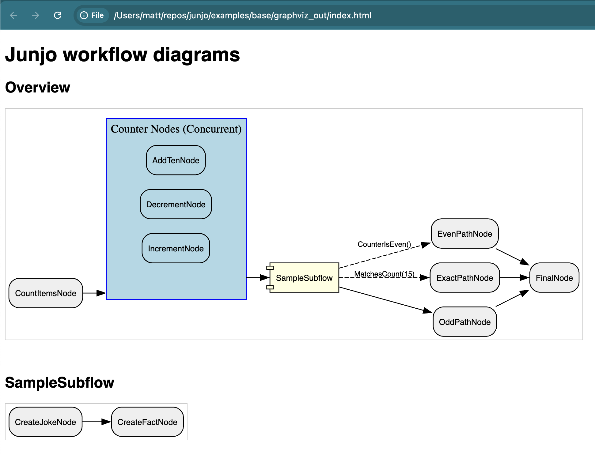
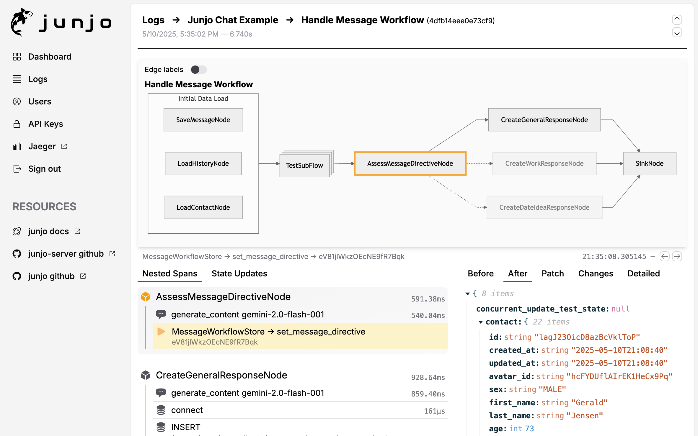

.. _visualizing_workflows:

================================================
Visualizing AI Workflows
================================================

Understanding the structure and execution flow of your AI workflows and agents is crucial for development, debugging, and optimization. 

This guide focuses on Junjo's built-in Graphviz integration to generate static diagrams of your workflow architecture as you code, and touches upon the dynamic visualization capabilities of Junjo AI Studio.

*A screenshot of a basic Junjo Graph workflow rendered by Graphviz.*

Why Visualize Your AI Workflows?
---------------------------------

Complex AI systems, especially those involving multiple Large Language Model (LLM) calls, conditional logic, and concurrent operations, can quickly become black boxes. Visualization helps to:

* **Increase Development Speed:** Quickly understand the structure of complex workflows, and how code changes affect the overall system.
* **Collaborate with Non-Developers:** Share visual representations with stakeholders who may not be familiar with the codebase, making it easier to discuss changes and improvements.
* **Enhance Documentation:** Provide clear diagrams that can be included in documentation, making it easier for new developers to understand the system.
* **Clarify Architecture:** See the explicit connections, dependencies, and potential paths of execution within your graph.
* **Aid Debugging:** Quickly identify unexpected pathways, bottlenecks, or errors in graph logic.
* **Facilitate Collaboration:** Share clear diagrams with team members to ensure everyone understands the workflow.
* **Improve Onboarding:** New developers can grasp the system's design much faster.
* **Support Eval-Driven Development:** Visual feedback complements testing by showing *how* data and control flow through the system during different evaluation scenarios.
* **Understand Agentic Behavior:** For more autonomous agents, visualizing the graph (even if parts are dynamically determined) helps in analyzing decision-making processes.

Generating Workflow Diagrams with Graphviz
------------------------------------------

Junjo can directly render your workflow graphs as images using Graphviz. Generate detailed diagrams of your main workflow and any nested subflows, including how ``RunConcurrent`` nodes are structured.

Prerequisites
~~~~~~~~~~~~~

1.  **Graphviz System Installation:**
    Graphviz must be installed on the system where you're generating the diagrams (e.g., your development machine or Docker container).

    For macOS with Homebrew:

    .. code-block:: bash

        brew install graphviz

    For other systems, please refer to the official `Graphviz download page <https://graphviz.org/download/>`_.

2.  **Python Dependencies:**
    Install the optional ``graphviz`` extras for the Junjo library. If you are using ``uv`` and have a ``pyproject.toml`` with these defined (e.g., in a `dev` or `graphviz` extra):

    .. code-block:: bash

        uv pip install -e ".[dev,graphviz]"

Generating Assets
~~~~~~~~~~~~~~~~~
The ``Graph`` object in Junjo provides an ``export_graphviz_assets()`` method. This function will:

* Generate ``.dot`` notation files for your main graph and each subflow.
* Render these ``.dot`` files into image files (SVG).
* Create an HTML page (``index.html``) that displays all generated diagrams with appropriate headings.

Example Usage
~~~~~~~~~~~~~

Let's assume you have a workflow graph factory defined, for instance, ``create_sample_workflow_graph`` from one of the Junjo examples.

In this example, we create an execute a visualize.py script to generate the Graphviz rendered assets.

.. code-block:: python
  :caption: visualize.py

  # Import the graph factory you want to visualize
  from base.sample_workflow.graph import create_sample_workflow_graph

  def main():
      # Every graph can execute .export_graphviz_assets() to generate all graphs and subflow graphs in a workflow
      # Creates .svg renderings, .dot notation files, and an HTML template to render the graphs
      create_sample_workflow_graph().export_graphviz_assets()

  if __name__ == "__main__":
      main()

Running the script (e.g., ``python visualize.py``) will create a directory ``graphviz_out`` containing the rendered assets.

Visual Elements:

* **Nodes:** Represent individual processing units (your Python functions wrapped in Junjo ``Node`` objects).
* **Edges:** Show the directed flow and conditions between nodes. Conditional edges are typically styled differently (e.g., dashed lines with labels).
* **Clusters (for RunConcurrent):** ``RunConcurrent`` nodes are rendered as distinct clusters, visually grouping the concurrently executing nodes.
* **Subflows:** Subflows are initially shown as a single "component" shape in the overview graph. A separate diagram is generated for each subflow, detailing its internal structure. This allows for a clean, hierarchical drill-down approach to understanding complex workflows.

Dynamic Telemetry with Junjo AI Studio
--------------------------------------
For real-time observation and debugging of workflow executions, Junjo integrates seamlessly with OpenTelemetry. The optional, open-source `Junjo AI Studio <https://github.com/mdrideout/junjo-ai-studio>`_ ingests these telemetry traces and provides a web interface to:

* **Visualize live execution graphs:** See the path taken by a specific execution.
* **Step through state changes:** Observe how the redux-inspired state machine is updated by each node.
* **Inspect inputs and outputs:** Understand the data flowing through your workflow at each step.

While Graphviz provides a static "blueprint" of your workflow's potential paths, Junjo AI Studio offers a dynamic view of actual executions, making it an invaluable tool for debugging and fine-tuning your AI applications.

.. note::
   Junjo remains decoupled from any specific AI model or framework. The visualization tools help you organize and understand the flow of your Python functions, regardless of whether they are LLM calls, database operations, or other business logic.

By combining static Graphviz diagrams for architectural understanding with dynamic Junjo AI Studio telemetry for execution analysis, developers can build, test, and maintain complex AI workflows with greater confidence and clarity.

---

Next Steps:
  - Explore the :doc:`getting_started` guide for installation and basic usage.
  - Dive into the :doc:`api` reference for detailed information on Junjo's components.
  - Learn about :doc:`eval_driven_dev` for robust testing of your workflows.
  - Set up :doc:`junjo_ai_studio` for dynamic telemetry visualization.