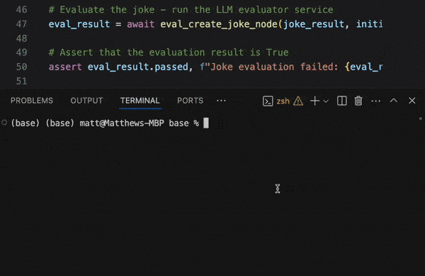

.. _eval_driven_dev:

Eval-Driven Development
=====================================

Eval-Driven Development (EDD) is a critical development strategy for applications powered by Large Language Models (LLMs). This practice places continuous and rigorous evaluation at the heart of the development lifecycle.

Junjo accelerates EDD and complex workflow development by allowing one to iterate on their LLM prompts with many test inputs, and immediately see how the prompt changes impact the evaluation results.

*The above example demonstrates a simple pytest execution that gives pass / fail rates for a set of test inputs evaluating against a Junjo node.*

Powered by pytest
~~~~~~~~~~~~~~~~~~~~~~~

- Evaluate / Judge the output of your Junjo workflows and nodes with LLMs
- Test individual nodes
- Test entire workflows
- Automate testing with CI / CD pipelines
- Run on-demand as you iterate on your workflows
- It just uses **pytest**!
- Use tools like pytest-harvest to gather and track test results
- No proprietary tools or testing platforms are required - everything happens directly in your codebase

Pytest executions can initialize an input state for the node, and analyze the results after the node executes its set_state updates.

Prerequisites
~~~~~~~~~~~~~~~~~~~~~~~

- The worked example below lives in the junjo repository's ``examples/base`` app, so clone the `junjo repository <https://github.com/mdrideout/junjo>`_ to run it
- Install ``pytest`` and ``pytest-asyncio`` in the environment used to run the evals (the example's async tests use ``@pytest.mark.asyncio``)
- Live eval execution requires ``GEMINI_API_KEY`` in the environment used to run pytest

Library Example
~~~~~~~~~~~~~~~~~~~~~~~

Check out :code:`examples/base/src/base/sample_workflow/sample_subflow/nodes/create_joke_node/test` to see an example eval system, setup to evaluate the joke created. 

- `Github link to test example <https://github.com/mdrideout/junjo/tree/master/sdks/python/examples/base/src/base/sample_workflow/sample_subflow/nodes/create_joke_node/test>`_

- It uses a combination of asserts and live LLM evaluations
- This example uses Gemini to evaluate the results of the `create_joke_node` against several test inputs inside `test_cases.py`
- The eval has a prompt inside `test_prompt.py`
- `test_node.py` executes the pytest test
- The live `node.py` LLM call is executed to generate the result and state update for evaluation
- Test failures include reasons why the prompt failed to generate output that passed the evaluation. See the `test_schema.py`.

The following is a condensed version of the eval test in `test_node.py`. Each test case in `test_cases.py` is a dictionary containing only the state fields the node requires, making it easy to build large eval sets by mocking node input state.

.. code-block:: python

    import pytest

    from base.sample_workflow.sample_subflow.nodes.create_joke_node.node import CreateJokeNode
    from base.sample_workflow.sample_subflow.nodes.create_joke_node.test.test_cases import test_cases
    from base.sample_workflow.sample_subflow.nodes.create_joke_node.test.test_service import eval_create_joke_node
    from base.sample_workflow.sample_subflow.store import SampleSubflowState, SampleSubflowStore

    @pytest.mark.asyncio(loop_scope="session")
    @pytest.mark.parametrize("test_case", test_cases)  # e.g. {"items": ["cat", "lasers", "space"]}
    async def test_create_joke_node(test_case: dict):
        # Initialize the node's input state from the test case
        initial_state = SampleSubflowState.model_validate(test_case)
        assert initial_state.items is not None
        store = SampleSubflowStore(initial_state=initial_state)

        # Execute the node service
        node = CreateJokeNode()
        await node.service(store)

        # Assert against the resulting state
        state_result = await store.get_state()
        assert state_result.joke

        # Evaluate the joke - run the LLM evaluator service
        eval_result = await eval_create_joke_node(state_result.joke, initial_state.items)
        assert eval_result.passed, f"Joke evaluation failed: {eval_result.reason}"

Run the sample eval from ``examples/base``:

.. code-block:: bash

    uv run --package base -m pytest src/base/sample_workflow/sample_subflow/nodes/create_joke_node/test/test_node.py -v

On mission critical workflows, this setup can be used to orchestrate hundreds or thousands of test inputs against a prompt to ensure it covers all use cases well.

Testing Model Changes
~~~~~~~~~~~~~~~~~~~~~~~

This is also a great way to evaluate whether changing LLM models increases or decreases eval pass / fail rates, or changes the speed at which evals are completed.
