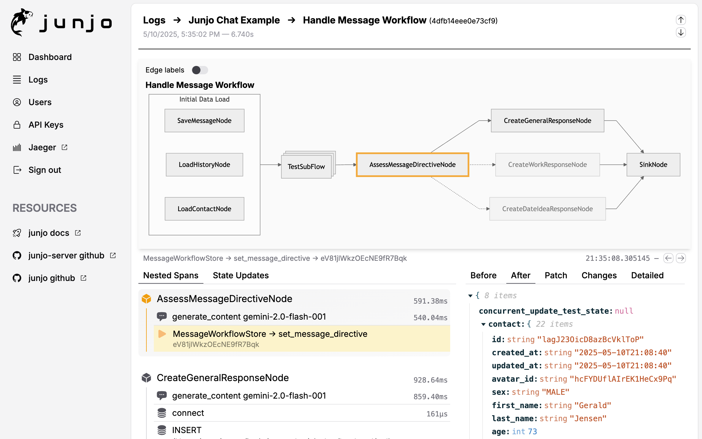

.. toctree::
   :maxdepth: 2
   :caption: Junjo Python SDK Docs:
   :hidden:

   getting_started
   tutorial
   agents
   agent_testing
   agent_composition
   core_concepts
   state_management
   concurrency
   subflows
   hooks
   visualizing_workflows
   eval_driven_dev
   api

.. toctree::
   :maxdepth: 2
   :caption: Junjo AI Studio:
   :hidden:

   junjo_ai_studio
   docker_reference
   deployment
   opentelemetry

.. toctree::
   :maxdepth: 1
   :caption: External Links
   :hidden:

   Junjo PyPI <https://pypi.org/project/junjo/>
   GitHub - Junjo <https://github.com/mdrideout/junjo>
   GitHub - Junjo AI Studio <https://github.com/mdrideout/junjo/tree/master/apps/studio>

.. toctree::
   :maxdepth: 1
   :caption: Example Apps
   :hidden:

   Base Example <https://github.com/mdrideout/junjo/tree/master/sdks/python/examples/base>
   AI Chat <https://github.com/mdrideout/junjo/tree/master/sdks/python/examples/ai_chat>

Junjo Python SDK Documentation
==================================

`Junjo on PyPI <https://pypi.org/project/junjo/>`_

   順序 (junjo): order, sequence, procedure

Junjo is a modern Python library for designing, executing, testing, and
debugging explicit graph Workflows and bounded, provider-neutral Agents.

Use a Workflow when the application knows the possible procedure in advance,
and an Agent when a model must choose among an explicit set of typed Tools at
runtime. Both execution modes remain isolated, testable, and observable.

*A screenshot of Junjo AI Studio, Junjo's companion OpenTelemetry observability platform for debugging graph workflow state.*

Benefits
---------

* ✨ Visualize your AI workflows
* 🧭 Inspect dynamic Agent model and Tool operation timelines
* 🧠 Redux inspired state management and state debugging tools
* ⚡️ Concurrency and type safety native with asyncio and pydantic
* 🔗 Organize conditional chains of LLM calls into observable graph workflows
* 🏎️ Easy patterns for directed graph loops, branching, and concurrency
* 🧪 Eval-Driven Development focused
   * Build massive eval sets by mocking node state
   * Programmatically build and update eval sets with agentic code assistants
   * Eval patterns are based on pytest, leveraging its testing framework and capabilities
   * Rapidly iterate on your AI capabilities and avoid regressions
* 🔭 OpenTelemetry native
   * Provides organized, structured traces to any OpenTelemetry provider
   * Companion open source `Junjo AI Studio <https://github.com/mdrideout/junjo/tree/master/apps/studio>`_ enhances debugging and evaluation of production data

Junjo's Philosophy
-------------------

**🔍 Transparency**

Junjo strives to be the opposite of a "black box". Transparency, observability, eval driven development, and production data debugging are requirements for AI applications handling mission critical data, that need repeatable and high accuracy chained LLM logic. 

**⛓️‍💥 Decoupled**

Junjo doesn't change how you implement LLM providers or make calls to their services. 

Continue using `google-genai <https://github.com/googleapis/python-genai>`_, `openai-python <https://github.com/openai/openai-python>`_, `grok / xai sdk <https://github.com/xai-org/xai-sdk-python>`_, `anthropic-sdk-python <https://github.com/anthropics/anthropic-sdk-python>`_, `LiteLLM <https://github.com/BerriAI/litellm>`_ or even REST API requests to any provider.

Junjo remains decoupled from LLM providers. There are no proprietary implementations, no hijacking of python docstrings, no confusing or obfuscating decorators, and no middleman proxies. 

Junjo helps organize Python functions—whether they perform logic, model calls,
retrieval, or application I/O—into predictable, testable, and observable
Workflow and Agent executions.

**🥧 Conventional**

Junjo provides primitive building blocks for explicit graph Workflows, from
linear chains of LLM calls to conditional loops, branching paths, and
concurrent subflows. A Workflow declares its possible graph paths before
execution; model calls inside Nodes may update state used by edge conditions,
but they do not dynamically create or rewrite the graph.

The first-class ``Agent`` execution model handles the complementary case where
a model chooses the next capability at runtime from an explicit ordered set of
typed Tools. Agent is a sibling to ``Workflow``: it does not fabricate a Graph,
share mutable run state, or delegate Junjo's limits and lifecycle to a model
provider.

Junjo uses conventional Pythonic architecture. Rather than obfuscating,
proprietary decorators or runtime scripts that hijack execution, Workflows use
explicit Python Graph primitives and Agents use ordinary typed definitions,
bindings, and Tools. Pydantic owns the declared data boundaries.

State is modeled after the conventional `Elm Architecture <https://guide.elm-lang.org/architecture/>`_, and inspired by `Redux <https://redux.js.org/>`_ for clean separation of concerns, concurrency safety, and debuggability.

This helps language servers and coding agents understand large Junjo
applications without learning proprietary, hidden execution patterns.

Junjo organizes conventional OpenTelemetry spans into understandable execution
evidence. Existing OpenTelemetry providers continue to work, while `Junjo AI
Studio <https://github.com/mdrideout/junjo/tree/master/apps/studio>`_ adds
specialized Workflow graphs, Agent timelines, Store reconstruction, and
evidence-integrity diagnostics.

**🤝 Compatible**

Junjo can work alongside external AI Agent frameworks. Application code can
expose a Junjo Workflow to one of those frameworks as a **tool** for a
high-accuracy, repeatable process such as RAG retrieval or complex document
parsing. That adapter does not turn the Workflow itself into an Agent.

You can execute autonomous agent capabilities from other libraries inside a Junjo AI workflow. For example, a Junjo workflow node can run a `smolagents <https://github.com/huggingface/smolagents>`_ tool calling agent as a single step within a greater Junjo workflow or subflow.

Getting Started
---------------

See the :doc:`getting_started` page for installation and basic usage.

API Reference
-------------

See the :doc:`api` page for the full API reference.

Eval-Driven Development
------------------------

See the :doc:`eval_driven_dev` page for more information on how to use Junjo for eval-driven development.
